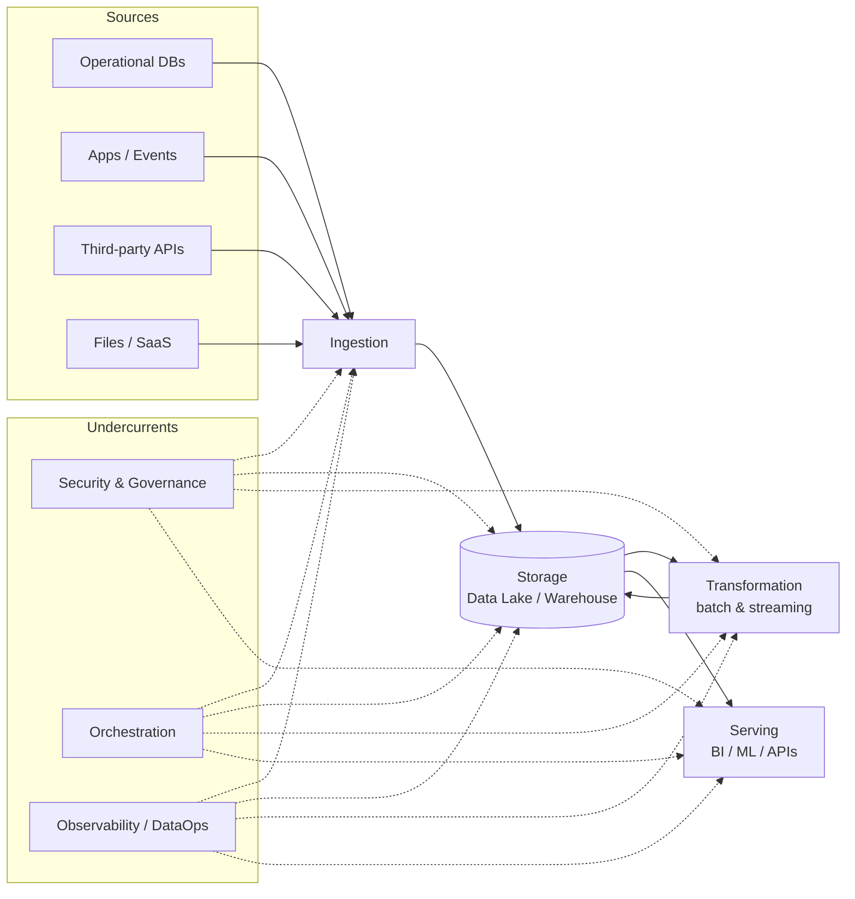
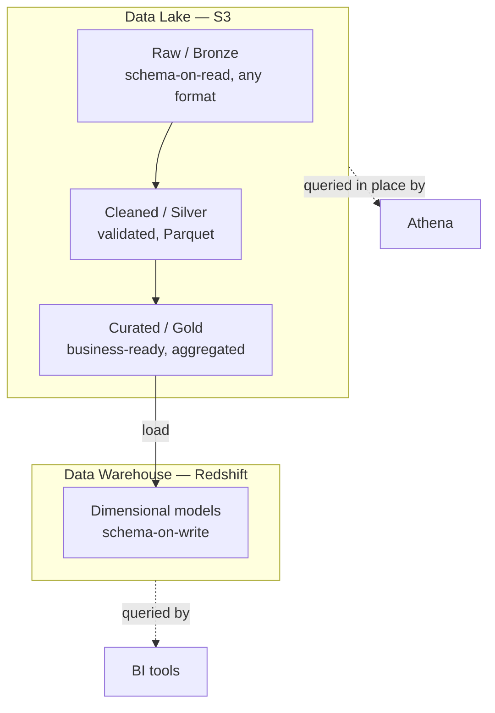
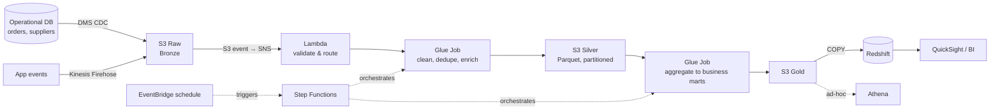

# 00 · Foundations

> The goal of this module is to give you a *map* before we hand you tools. Most AWS data engineering material throws services at you immediately — Glue, Kinesis, Redshift — and you end up knowing what buttons exist without knowing why you'd press them. We start one level up: what data engineering is actually for, what the recurring problems are, and how AWS's catalogue maps onto those problems.

---

## 📘 / 🔧 / 🏛  What is data engineering, really?

Strip away the tooling and data engineering is the discipline of **moving data from where it is produced to where it can create value, reliably and at a cost the business will tolerate.** Everything else — the services, the file formats, the orchestration — is implementation detail in service of that sentence.

It helps to see the whole flow before zooming in. This is the *data engineering lifecycle*, and every module in this repo is one stage of it:

The horizontal flow (ingest → store → transform → serve) is the visible pipeline. The **undercurrents** underneath — security, orchestration, observability — are not stages; they run through *everything*. A common failure in junior work is treating those undercurrents as features to bolt on later. They are not. They are why the senior person's pipeline survives contact with production and yours doesn't.

> 🏛 **Architect's framing:** When you evaluate any pipeline — yours or in a design review — ask of *each stage*: where does the data live, who can read it, what happens when this stage fails, and how would I know it failed? If you can't answer all four, the design isn't done.

---

## 🏛 The five questions that drive every AWS data decision

Before you can pick a service, you have to know what you're optimizing for. Almost every AWS data engineering decision reduces to a position on these five axes:

1. **Latency** — does the answer need to be fresh in milliseconds, minutes, or is overnight fine? This single question splits the entire streaming-vs-batch world.
2. **Volume & velocity** — gigabytes a day or terabytes an hour? This decides whether a Lambda function suffices or you need Spark on EMR.
3. **Structure** — rigid schema, evolving schema, or genuinely unstructured? This decides lake vs warehouse, Parquet vs JSON, schema-on-read vs schema-on-write.
4. **Cost model** — is the workload steady (favoring provisioned capacity) or spiky (favoring serverless)? AWS will happily let you pay 10x for the wrong choice here.
5. **Operational burden** — how much of this team's time do you want spent babysitting infrastructure vs building? This is the serverless-vs-managed-vs-self-hosted spectrum.

Hold these in mind through every later module. When we say "use Glue here, not EMR," it will always trace back to a position on these five axes.

---

## 🔧 The AWS service landscape, organized by job

AWS has ~200 services and the names are deliberately unhelpful. Here is the subset that matters for data engineering, grouped by the *job* they do rather than by AWS's marketing categories. Each links to its module.

### Storage — "where does it live?"
| Service | One-line role | When it's the answer |
|---|---|---|
| **S3** | Object store; the floor of every data lake | Default home for raw and processed data. Start here. → [Mod 02](../02-storage-s3-lake/) |
| **Redshift** | Columnar MPP data warehouse | Structured analytics at scale, BI serving. → [Mod 07](../07-data-warehouse-redshift/) |
| **DynamoDB** | Serverless key-value / document NoSQL | Low-latency lookups, app state, not analytics |
| **RDS / Aurora** | Managed relational DBs | Operational source systems; rarely the analytics target |

### Ingestion — "how does it get in?"
| Service | One-line role | When it's the answer |
|---|---|---|
| **Kinesis Data Streams** | Ordered, replayable event stream | Real-time event ingest you control. → [Mod 05](../05-streaming/) |
| **Kinesis Firehose** | Managed delivery stream to S3/Redshift | "Just land my stream in S3" with zero ops. → [Mod 03](../03-ingestion/) |
| **MSK** | Managed Apache Kafka | You need Kafka's ecosystem / multi-consumer semantics. → [Mod 05](../05-streaming/) |
| **DMS** | Database Migration Service / CDC | Replicating an operational DB into the lake. → [Mod 03](../03-ingestion/) |
| **AppFlow** | Managed SaaS connectors | Pulling Salesforce, Google Analytics, etc. |

### Processing — "how does it get transformed?"
| Service | One-line role | When it's the answer |
|---|---|---|
| **Glue (ETL)** | Serverless Spark + data catalog | Default batch ETL; no cluster to manage. → [Mod 04](../04-batch-processing/) |
| **EMR** | Managed Hadoop/Spark clusters | Heavy, tuned, or long-running Spark/Hive. → [Mod 04](../04-batch-processing/) |
| **Lambda** | Serverless functions | Light, event-driven, per-record transforms. → [Mod 03](../03-ingestion/) |
| **Athena** | Serverless SQL over S3 | Ad-hoc query of the lake without loading it. → [Mod 02](../02-storage-s3-lake/) |
| **Managed Flink** | Streaming SQL/Java on Kinesis/MSK | Real-time aggregations and windowing. → [Mod 05](../05-streaming/) |

### Orchestration — "how does it run in order, reliably?"
| Service | One-line role | When it's the answer |
|---|---|---|
| **Step Functions** | Serverless state machine | Coordinating AWS services with retries/branching. → [Mod 06](../06-orchestration/) |
| **MWAA** | Managed Airflow | Complex DAGs, Python-defined, cross-system. → [Mod 06](../06-orchestration/) |
| **EventBridge** | Event bus + scheduler | Event-driven triggering and cron. → [Mod 06](../06-orchestration/) |

### Governance — "who can touch it, and is it legal?"
| Service | One-line role | When it's the answer |
|---|---|---|
| **Lake Formation** | Fine-grained lake permissions | Column/row-level access on the lake. → [Mod 08](../08-governance-security/) |
| **Glue Data Catalog** | Central metadata / schema registry | The "table definitions" every query engine reads. → [Mod 04](../04-batch-processing/) |
| **IAM** | Identity & access | The substrate. Always. → [Mod 01](../01-aws-core-services/) |
| **KMS** | Managed encryption keys | Encrypting everything at rest. → [Mod 08](../08-governance-security/) |

> 🏛 **Why this grouping matters:** Notice that several services appear as "the answer" for overlapping jobs — Glue *and* EMR *and* Lambda can all transform data. That overlap is not redundancy; it's the five-axis trade-off in action. Half of architect-level skill is knowing which one to reach for, and Modules 03–05 are largely about exactly that distinction.

---

## 📘 The lake, the warehouse, and the lakehouse

This is the single most-tested conceptual distinction in the field and on the exam, so it gets its own treatment.

| | **Data Lake** | **Data Warehouse** | **Lakehouse** |
|---|---|---|---|
| Storage | S3 (cheap object store) | Proprietary columnar (Redshift) | S3 + table format (Iceberg) |
| Schema | On *read* (flexible) | On *write* (rigid, validated) | On read, *with* ACID guarantees |
| Best for | Raw, varied, ML, exploration | Structured BI, fast SQL | Both, at the cost of more tooling |
| Cost | Lowest (storage is cheap) | Higher (compute coupled) | Low storage, flexible compute |
| Risk | Becomes a "data swamp" without governance | Expensive, rigid, scales awkwardly | Newest, most moving parts |

The historical arc matters: lakes appeared because warehouses were too rigid and expensive for the variety of modern data; the lakehouse appeared because pure lakes lacked the reliability (ACID transactions, schema enforcement) that warehouses always had. On AWS, the lakehouse is realized with **S3 + Apache Iceberg + Glue Catalog + Athena/Redshift Spectrum** — we build exactly this in [Module 09](../09-architecture-patterns/).

> 💰 The economic engine behind all of this: S3 storage is roughly **$0.023/GB-month**, while warehouse storage is bundled with expensive compute. Keeping the bulk of data in S3 and bringing compute to it on demand is the central cost lever of modern data architecture. Almost every "modern data stack" decision is downstream of this one price difference.

---

## 🔧 A concrete pipeline, end to end

To make the abstract map real, here is the pipeline we will actually build across this repo — the same shape as a supplier/transaction enrichment pipeline you'd find in a real consultancy engagement:

Every box in that diagram is a module. By the end you will have built each piece and, more importantly, understand why each service was chosen over its alternatives. The SNS-triggered Lambda routing pattern in the middle is one we treat in real operational depth — structured logging, idempotent S3 keys, dead-letter handling — in [Module 03](../03-ingestion/).

---

## What's in this module

- [`architect-notes.md`](./architect-notes.md) — the decision frameworks in more depth: when serverless stops being cheaper, the "build vs managed" spectrum, and how to read a requirements doc for its hidden latency assumptions.
- [`glossary.md`](./glossary.md) — the vocabulary, defined plainly. Skim it now, return when a term bites.
- Lab: [`labs/00-account-setup`](../labs/) — set up an AWS account safely (budgets, IAM, no root-user usage) before you spend a cent.

---

### Self-check before moving on

You're ready for Module 01 when you can answer these without looking:

1. Name the four stages of the data engineering lifecycle and the three undercurrents.
2. Given "we need yesterday's sales on a dashboard by 8am," which of the five axes are you being told about, and which are you *not*?
3. Why is S3 the floor of almost every AWS data architecture? (Hint: the answer is partly a price.)
4. A team says "let's just put everything in Redshift." Give one reason that might be right and one reason it might be expensive.
