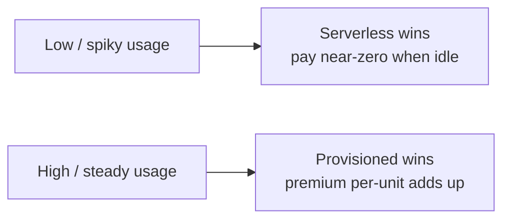

# 00 · Architect Notes — Decision Frameworks

These are the mental tools you reach for *before* opening the AWS console. They don't expire when a service gets renamed.

---

## When serverless stops being cheaper

Serverless (Lambda, Glue, Athena, Firehose) is sold as "cheaper and zero-ops." That's true at low and spiky utilization and *false* at high steady utilization. The crossover is the thing to understand.

Serverless bills per-use with a premium per unit; provisioned bills a flat rate regardless of use. So:

The practical rule: if a workload runs continuously near full utilization, model the provisioned cost — at some utilization threshold (often quoted around 60–70% sustained), provisioned EMR or a provisioned Redshift cluster beats the serverless equivalent. Below it, serverless almost always wins once you price in the *engineer-hours* you're not spending on cluster management.

> 🏛 The mistake in both directions: juniors over-use provisioned ("a cluster feels real"); cost-cutters over-use serverless and get surprised by a $40k Athena bill from someone running `SELECT *` on unpartitioned data. The fix for the second is in Module 02 — partitioning and columnar formats.

---

## The build-vs-managed-vs-self-hosted spectrum

For any capability, you sit somewhere on:

| | Self-hosted on EC2 | Managed (MSK, EMR, RDS) | Serverless (Glue, Firehose, Aurora Serverless) |
|---|---|---|---|
| Control | Total | High | Low |
| Ops burden | You own everything | AWS owns the undifferentiated parts | AWS owns nearly all of it |
| Cost at scale | Cheapest *if* you're good | Middle | Premium per-unit |
| Time to value | Slowest | Medium | Fastest |
| Right when | You have a hard requirement no managed service meets | You need a specific engine (Kafka, Spark) tuned | The capability isn't your differentiator |

The default for a competent team should be **as far right as the requirements allow.** Move left only when a specific requirement forces it: a Kafka feature Firehose lacks, a Spark tuning EMR allows that Glue doesn't, a compliance need for dedicated tenancy. "We might need control someday" is not a requirement; it's how teams end up babysitting clusters instead of shipping.

---

## Reading a requirements doc for hidden latency

Requirements rarely state latency honestly. They say "real-time" when they mean "within five minutes," and "real-time dashboard" when a 1-hour batch would satisfy every actual user. Latency is the most expensive axis to over-deliver on, so interrogate it:

- **"Real-time"** → ask: real-time for *whom*, doing *what decision*? A fraud block needs milliseconds. A "live" exec dashboard refreshed hourly is fine and 100x cheaper.
- **"Up to date"** → almost always satisfiable by batch. Find the actual SLA.
- **"Historical / reporting"** → batch, and you can probably widen the window to save money.

Map the honest answer onto this:

| Honest latency need | Pattern | AWS services |
|---|---|---|
| Milliseconds, per-event | Stream processing | Kinesis/MSK + Managed Flink + Lambda |
| Seconds–minutes | Micro-batch / streaming-to-S3 | Firehose + Glue streaming |
| Minutes–hours | Scheduled batch | EventBridge + Glue + Step Functions |
| Daily / overnight | Bulk batch | Glue/EMR on a cron |

> 💰 Every step up that table multiplies cost and operational complexity. The architect's job is to deliver the cheapest pattern that *actually* meets the need — not the most impressive one.

---

## The idempotency discipline

A pipeline that can't safely re-run is a pipeline that will eventually corrupt data, because at some point it *will* run twice — a retry, a replay, a backfill, a human re-triggering it. Designing every stage to be idempotent (re-running produces the same result, not duplicated/doubled data) is not optional polish; it's the difference between a pipeline you can operate calmly and one you fear.

Concrete AWS techniques, all revisited in later modules:
- **Deterministic S3 keys** derived from the input (e.g. `silver/dt=2025-01-15/source-hash.parquet`) so a re-run overwrites rather than duplicates.
- **Idempotent sinks** — `MERGE`/upsert into Redshift or Iceberg keyed on a natural key, not blind `INSERT`.
- **Message dedup** — dedup keys on SQS/Kinesis records so a redelivered event is a no-op.

This shows up first, in real form, in the SNS-triggered Lambda of Module 03.
