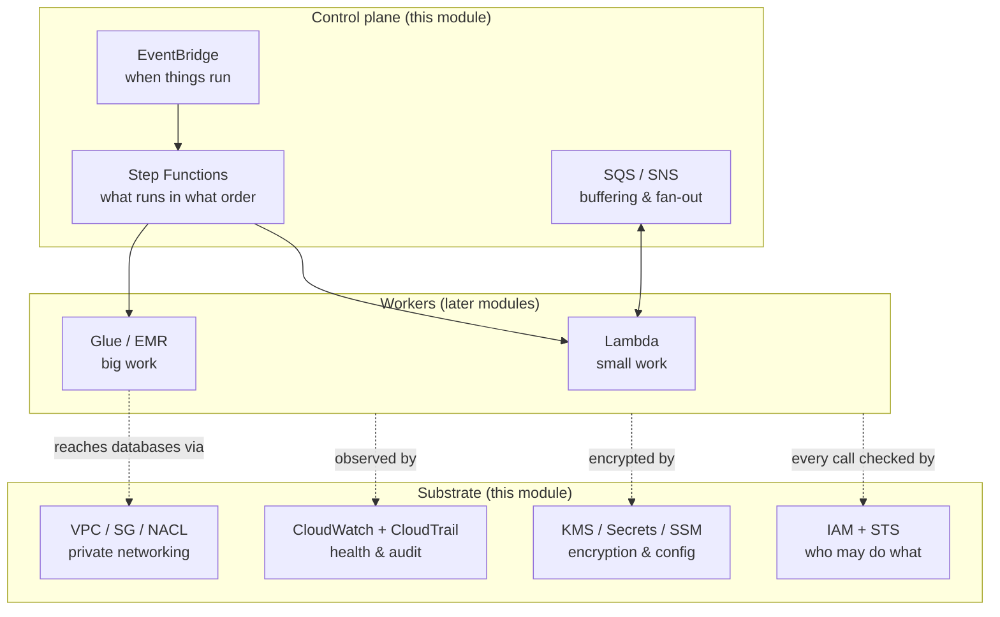

# 01 · AWS Core Services — The Substrate Under Every Pipeline

> Every data service you'll meet later — Glue, Athena, Redshift, Kinesis — stands on the services in this module. Identity (IAM), networking (VPC), encryption and config (KMS/Secrets/SSM), observability and audit (CloudWatch/CloudTrail), messaging (SQS/SNS), events and time (EventBridge), small compute (Lambda), and workflow control (Step Functions). Learn these once, properly, and every later module gets easier — most "data pipeline bugs" are actually bugs in this layer.

**Cert domains:** 4 (Security & Governance) for IAM/KMS/CloudTrail; 3 (Operations) for CloudWatch/EventBridge/Step Functions; 1 (Ingestion & Transformation) for Lambda/SQS/EventBridge patterns.

---

## The mental model

A pipeline is workers doing work. Everything in this module is the scaffolding around the workers:

## Pages in this module

Each page follows the same structure: what it is → why it exists → where it fits → diagram → real data-engineering example → CLI/code → security → cost → common mistakes → troubleshooting → architect notes → interview questions → cert notes.

| Page | Covers | The one-line takeaway |
|---|---|---|
| [iam.md](./iam.md) | IAM, STS, roles, policies, cross-account, OIDC | Pipelines run as scoped roles with temporary credentials — one role per component |
| [vpc.md](./vpc.md) | VPC, subnets, Security Groups, NACLs, endpoints | Most serverless pipelines need no VPC; when they do, gateway endpoints save real money |
| [kms.md](./kms.md) | KMS, envelope encryption, Secrets Manager, SSM Parameter Store | Encrypted data needs S3 *and* KMS permissions; rotating credentials → Secrets Manager, config → Parameter Store |
| [cloudwatch.md](./cloudwatch.md) | CloudWatch logs/metrics/alarms/dashboards, CloudTrail | CloudWatch = is it healthy; CloudTrail = who did what; alarm on outcomes and freshness |
| [sqs-sns.md](./sqs-sns.md) | SQS, SNS, DLQs, fan-out, idempotency | SQS = to-do list, SNS = megaphone; every production queue gets a DLQ |
| [eventbridge.md](./eventbridge.md) | Event bus, rules, patterns, Scheduler | EventBridge decides *when*; Step Functions decides *what order*; workers do the work |
| [lambda.md](./lambda.md) | Lambda triggers, limits, concurrency, cold starts | Lambda is the router and light-transformer, never the ETL engine (15-minute wall) |
| [step-functions.md](./step-functions.md) | State machines, ASL, Retry/Catch, `.sync`, Map | The pipeline's control flow as a managed, retryable, visible artifact |

## Suggested reading order

1. **[iam.md](./iam.md)** — nothing works, and no bug is debuggable, without this.
2. **[kms.md](./kms.md)** — because encrypted-data AccessDenied is IAM's evil twin.
3. **[cloudwatch.md](./cloudwatch.md)** — you'll need logs from the very first lab.
4. **[lambda.md](./lambda.md)** → **[sqs-sns.md](./sqs-sns.md)** → **[eventbridge.md](./eventbridge.md)** — the event-driven toolkit, in dependency order.
5. **[step-functions.md](./step-functions.md)** — the conductor, once you know the instruments.
6. **[vpc.md](./vpc.md)** — read fully when you first touch RDS/Redshift/EMR; skim now.

## How this module shows up in the labs

- **Lab 01** (S3 lake): IAM implicitly — your CLI identity, the CDK deploy role, bucket policies (`enforce_ssl`).
- **Lab 05** (Lambda S3 trigger): lambda.md + sqs-sns.md patterns, for real.
- **Lab 06** (EventBridge): eventbridge.md schedules and rules.
- **Lab 07** (Step Functions): step-functions.md end to end.
- **Lab 11** (CloudWatch): cloudwatch.md alarms and dashboards on the whole pipeline.

## The five habits this module should leave you with

1. **Debug identity first.** `aws sts get-caller-identity`, then read the AccessDenied message — it names principal, action, resource.
2. **One role per component, least privilege, no deletes on raw.**
3. **Everything that can retry will deliver duplicates** — make every consumer idempotent.
4. **Every async path gets a DLQ and an alarm.**
5. **No secrets in code, env vars, logs, or state payloads** — Secrets Manager/Parameter Store, referenced at runtime.
