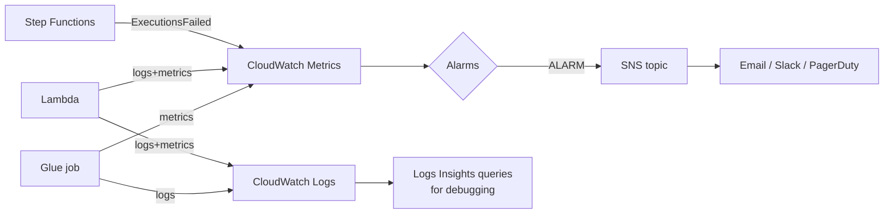

# CloudWatch & CloudTrail — Observability and Audit

Two services people confuse, with one clean distinction:

- **CloudWatch** answers *"is the system healthy?"* — logs, metrics, alarms, dashboards. Operational.
- **CloudTrail** answers *"who did what?"* — a record of API calls. Audit/security.

## 1. Amazon CloudWatch

### What it is

CloudWatch is AWS's built-in observability service, made of four building blocks:

| Block | What it holds | Data engineering example |
|---|---|---|
| **Logs** | Text output, in log groups → streams | Glue job driver/executor logs, Lambda prints |
| **Metrics** | Numeric time series (namespace/name/dimensions) | `glue.driver.aggregate.numFailedTasks`, Lambda `Errors`, Kinesis `IteratorAgeMilliseconds` |
| **Alarms** | Rules that watch a metric and change state (OK / ALARM / INSUFFICIENT_DATA) | "Glue job failed ≥1 time in 5 min → notify SNS" |
| **Dashboards** | Curated charts | One pipeline-health dashboard per platform |

### Why it exists

Pipelines run unattended at 3am. Without centralized logs and metrics you learn about failures from angry stakeholders at 9am. CloudWatch exists so every managed service has a *default* place to emit what happened, and so you can turn "what happened" into "wake someone up" (alarms) without building a monitoring stack.

### Where it fits in data engineering

Monitoring is one of the "undercurrents" that spans every pipeline stage. The minimum production posture for this repo's pipeline:



Alarm on **outcomes, not noise**: failed executions, records-in-DLQ, data freshness (a custom metric), Kinesis iterator age (consumer falling behind). One meaningful alarm beats twenty ignored ones.

### Real example + CLI

```bash
# Tail a Glue job's logs live while it runs
aws logs tail /aws-glue/jobs/output --follow --since 10m

# Search errors across a Lambda's log group
aws logs filter-log-events --log-group-name /aws/lambda/validate-upload \
  --filter-pattern "ERROR" --max-items 20

# Create the alarm every pipeline needs: job failures -> SNS
aws cloudwatch put-metric-alarm \
  --alarm-name glue-bronze-to-silver-failed \
  --namespace Glue --metric-name glue.driver.aggregate.numFailedTasks \
  --dimensions Name=JobName,Value=bronze_to_silver_orders \
  --statistic Sum --period 300 --evaluation-periods 1 \
  --threshold 1 --comparison-operator GreaterThanOrEqualToThreshold \
  --alarm-actions arn:aws:sns:us-east-1:ACCOUNT_ID:pipeline-alerts
```

Publish a **custom business metric** (the one that actually matters — did today's data arrive?):

```python
import boto3
cloudwatch = boto3.client("cloudwatch")
cloudwatch.put_metric_data(
    Namespace="RetailLake",
    MetricData=[{
        "MetricName": "SilverOrdersRowCount",
        "Dimensions": [{"Name": "IngestionDate", "Value": "2026-07-01"}],
        "Value": 20, "Unit": "Count",
    }],
)
```

Alarm on `SilverOrdersRowCount == 0` (or below a floor) and you have **freshness monitoring** — the check that catches "the job succeeded but processed nothing," which service metrics never catch.

## 2. AWS CloudTrail

### What it is & why

CloudTrail records **management API calls** in the account — who called `DeleteBucket`, from which IP, with which role, when. 90 days of event history is on by default; a **trail** persists events to S3 for long-term audit. It exists because security investigations and compliance audits both start with the same question: *who did what, when?*

**Data events** (S3 object-level GET/PUT, Lambda invokes) are *not* recorded by default — enable them selectively; at lake scale they are voluminous and billed.

```bash
# Who deleted that bucket?
aws cloudtrail lookup-events \
  --lookup-attributes AttributeKey=EventName,AttributeValue=DeleteBucket \
  --max-results 5
```

### Data engineering relevance

- **Audit:** "which principal read the PII prefix" → S3 data events (+ KMS decrypt events, see [kms.md](./kms.md)).
- **Debugging:** "why did the crawler config change" / "who modified the job" → management events.
- **Security detection:** EventBridge rules can match CloudTrail events, e.g. alert on `PutBucketPolicy` making a bucket public.

## IAM / security notes

- Services need permission to write logs: `logs:CreateLogGroup`, `logs:CreateLogStream`, `logs:PutLogEvents`. Missing-logs mysteries are usually this.
- **Never log secrets or PII.** Log record *identifiers*, not payloads. Logs replicate into places with looser access than the data.
- Protect the CloudTrail S3 bucket like evidence: separate bucket, tight policy, MFA-delete/Object Lock in regulated shops.
- Set **log retention** per group (default is *never expire* — cost leak): `aws logs put-retention-policy --log-group-name ... --retention-in-days 30`.

## Cost notes

Biggest data-platform observability costs, in order: **log ingestion** ($0.50/GB — a chatty Spark job in DEBUG can dwarf its own compute cost), log storage (set retention!), custom metrics (~$0.30/metric/month — dimensions multiply metrics), alarms (~$0.10/month each), CloudTrail data events (per-event, at lake scale = real money — scope to sensitive prefixes). Free: default service metrics, 90-day event history, first trail's management events.

## Common mistakes

1. **No alarm on job failure** — the #1 gap; monitoring that no one is told about is decoration.
2. Alarming on *everything* → alert fatigue → real alarms ignored.
3. Leaving log retention at "never expire."
4. Only monitoring *technical* success — job green, but 0 rows written. Add freshness/volume metrics.
5. Confusing CloudTrail (audit) with CloudWatch (ops) in design and in interviews.
6. Enabling S3 data events lake-wide without pricing it.

## Troubleshooting

| Symptom | Check | Fix |
|---|---|---|
| No logs from a job/function | Role's `logs:*` permissions; right region; exact log group name | Grant logging perms; Glue: enable continuous logging |
| Alarm stuck INSUFFICIENT_DATA | Is the metric ever emitted? Period vs emission frequency | Use correct dimensions; treat-missing-data setting |
| Alarm never fires though failures happen | Metric math/dimensions mismatch | Verify with `get-metric-statistics` for the exact dimensions |
| Logs Insights query finds nothing | Time range and log group selection | Widen range; check the *actual* group name |
| "Who changed X?" unanswerable | Only 90-day default history, no trail | Create a persistent trail to S3 now, before you need it |

## Architect notes

- Design monitoring around **the four questions**: Is it running? (heartbeat/schedule alarms) Did it succeed? (failure alarms) Is the data right? (quality metrics) Is the data on time? (freshness metrics). Most platforms only wire up the second.
- **Runbooks attached to alarms**: an alarm description should link to the runbook ([TROUBLESHOOTING-RUNBOOK](../TROUBLESHOOTING-RUNBOOK.md)). An alarm that doesn't tell the responder what to do just distributes anxiety.
- Centralize: in multi-account platforms, forward alarms/logs to a central observability account (Module 12).
- CloudWatch is not the only answer at scale — high-cardinality needs may push metrics to Prometheus/Grafana — but it is the default and integrates with everything here.

## Interview questions

1. *(Beginner)* CloudWatch vs CloudTrail? *(Health/ops telemetry vs API audit trail.)*
2. *(Beginner)* Metric vs alarm? *(Time series vs a rule that changes state on it and triggers actions.)*
3. *(Intermediate)* How do you get alerted when a Glue job fails? *(Alarm on the job's failure metric — or an EventBridge rule on the Glue job state-change event — target SNS.)*
4. *(Intermediate)* The job succeeded but wrote zero rows. How do you catch that class of failure? *(Custom metric — rows written / freshness — with a floor alarm; data quality checks that fail the pipeline.)*
5. *(Senior)* Design monitoring for a 50-pipeline platform. *(Standardized: every pipeline emits success/failure + rows + duration + freshness under a common namespace; alarms auto-created in IaC per pipeline; one dashboard per domain; alerts routed by severity — page vs ticket; runbook links; central account aggregation.)*
6. *(Scenario)* Compliance asks for evidence of every read of a sensitive S3 prefix for the last year. *(CloudTrail data events scoped to that prefix, delivered to a locked S3 bucket with retention; query with Athena.)*

## Certification notes (DEA-C01)

Domain 3 (Operations) tests CloudWatch pieces: logs vs metrics vs alarms, Logs Insights for debugging, alarm→SNS wiring, and Kinesis/Lambda/Glue key metrics. Domain 4 tests CloudTrail as the audit answer — "who accessed/changed X" is CloudTrail, not CloudWatch. Log retention and data-event cost appear as cost-optimization scenarios.

---
*Related: [sqs-sns.md](./sqs-sns.md) (SNS alert delivery) · [eventbridge.md](./eventbridge.md) (event-driven alerting) · Module 11 (production monitoring)*
