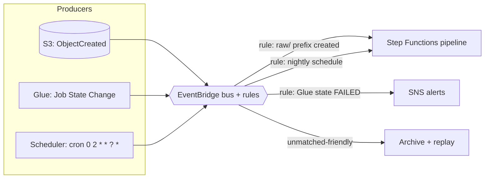

# EventBridge — The Event Router and Scheduler

## What it is

Amazon EventBridge is a serverless **event bus**: services (and your code) put events on the bus, **rules** match events by pattern, and matched events are routed to **targets** (Lambda, Step Functions, SQS, SNS, Glue workflows, API destinations…). It also tells time: **EventBridge Scheduler** runs things on cron or rate schedules.

One service, two jobs you'll use constantly:

1. **React to things happening** — "when a file lands in raw, start the pipeline."
2. **Make things happen on time** — "every day at 02:00 UTC, start the pipeline."

## Why it exists

Point-to-point integrations grow quadratically: every producer must know every consumer. An event bus makes producers publish *facts* ("object created", "job failed") without knowing who cares. Consumers subscribe by **pattern**, and adding a consumer requires zero producer changes. For scheduling, it replaces the cron server nobody wants to maintain.

## Where it fits in data engineering

EventBridge is the **trigger layer**. It starts pipelines (schedule or event), reacts to state changes (job failed → alert), and glues AWS services together without code:



The division of labor to remember: **EventBridge decides *when*; Step Functions decides *what happens in which order*; Glue/Lambda do the work.**

## Event patterns — the core skill

An EventBridge rule is a JSON pattern matched against event JSON. For S3 (with bucket notifications set to EventBridge):

```json
{
  "source": ["aws.s3"],
  "detail-type": ["Object Created"],
  "detail": {
    "bucket": { "name": ["ade-retail-lake-raw-123-us-east-1"] },
    "object": { "key": [{ "prefix": "raw/source=retail/entity=orders/" }] }
  }
}
```

This fires only for orders files in the raw zone — content-based filtering S3's own notifications can barely do (S3 native filters are one prefix+suffix per event type; EventBridge patterns are arbitrarily precise, and multiple rules can match the same event).

Catching failures — the pattern behind pipeline alerting:

```json
{
  "source": ["aws.glue"],
  "detail-type": ["Glue Job State Change"],
  "detail": { "state": ["FAILED", "TIMEOUT", "ERROR"] }
}
```

## Real example + CLI

```bash
# Nightly pipeline trigger (EventBridge Scheduler)
aws scheduler create-schedule \
  --name nightly-retail-pipeline \
  --schedule-expression "cron(0 2 * * ? *)" \
  --flexible-time-window Mode=OFF \
  --target '{"Arn":"arn:aws:states:us-east-1:ACCOUNT_ID:stateMachine:retail-pipeline",
             "RoleArn":"arn:aws:iam::ACCOUNT_ID:role/scheduler-invoke-pipeline",
             "Input":"{\"trigger\":\"nightly\"}"}'

# Rule: alert on any failed Glue job
aws events put-rule --name glue-job-failed \
  --event-pattern '{"source":["aws.glue"],"detail-type":["Glue Job State Change"],"detail":{"state":["FAILED","TIMEOUT"]}}'
aws events put-targets --rule glue-job-failed \
  --targets '[{"Id":"alert","Arn":"arn:aws:sns:us-east-1:ACCOUNT_ID:pipeline-alerts"}]'

# Enable S3 -> EventBridge for a bucket (one switch, all events)
aws s3api put-bucket-notification-configuration \
  --bucket ade-retail-lake-raw-123-us-east-1 \
  --notification-configuration '{"EventBridgeConfiguration": {}}'
```

Cron gotchas that bite everyone: EventBridge cron has **six fields** (minute hour day-of-month month day-of-week year), you can't set both day-of-month and day-of-week (one must be `?`), and **times are UTC** — "2am" for whom?

## Delivery semantics, retries, and replay

- Delivery to targets is **at-least-once**; targets must be idempotent (a theme by now).
- Failed deliveries retry with backoff for up to 24h; configure a **DLQ per target** so undeliverable events land somewhere visible instead of vanishing.
- **Archive + replay**: the bus can archive matched events and replay a time range later — the recovery story for "the pipeline was broken for 6 hours; reprocess everything that arrived."
- Scheduler vs legacy "scheduled rules": prefer **EventBridge Scheduler** (timezones, one-off schedules, flexible windows, higher quotas).

## IAM / security notes

- Rules invoke targets via a **role** (Scheduler/API destinations) or **resource policy** (Lambda/SNS/SQS targets get `events.amazonaws.com` permission). "Rule matches but nothing happens" is usually this permission missing.
- Event **content** rides the bus — don't put payloads/PII in custom events; put references (bucket/key, table/date).
- Cross-account buses (central "event backbone" account) need bus resource policies allowing the producer accounts — the multi-account integration pattern (Module 12).

## Cost notes

AWS-service events on the default bus are **free**. Custom/cross-account events ~$1/million; Scheduler invocations ~$1/million after a free tier; archive/replay per GB. EventBridge is effectively never the expensive part — but the things it triggers are: a misconfigured rule matching too broadly can start a Glue job per uploaded file. Scope patterns tightly.

## Common mistakes

1. **Pattern too broad** — triggering the pipeline for `_SUCCESS` markers, temp files, or the *output* the pipeline itself writes (see the loop below).
2. **The infinite loop:** rule on `Object Created` in a bucket triggers a job that *writes to the same bucket/prefix* → storm. Separate zones/prefixes and filter precisely.
3. Forgetting **UTC** in cron, or the `?` day-field rule.
4. No **DLQ on targets** — throttled/failing targets silently drop events after retries expire.
5. Testing patterns in production instead of `aws events test-event-pattern`.
6. Using S3 native notifications when you need multiple reactions or fine filtering — and fighting its one-notification-per-prefix limits.

## Troubleshooting

| Symptom | Check | Fix |
|---|---|---|
| Rule never fires | Pattern vs a real event (`test-event-pattern`); S3 bucket has EventBridge enabled? | Fix pattern; enable EventBridgeConfiguration on the bucket |
| Fires but target doesn't run | Target permissions (resource policy / role); target's own errors | Grant events.amazonaws.com invoke; check target logs |
| Fires twice / duplicates | At-least-once delivery; two matching rules? | Idempotent targets; audit rules |
| Schedule ran at wrong hour | UTC vs local | Use Scheduler with an explicit timezone |
| Events lost during outage | Any DLQ configured? Archive? | Add per-target DLQs; enable archive for replay |
| Throttling on target | Target concurrency limits | Put SQS between bus and worker to buffer |

## Architect notes

- **Event-driven vs scheduled** is a real design decision (full comparison in [SERVICE-DECISION-FRAMEWORK](../SERVICE-DECISION-FRAMEWORK.md)): event-driven gives freshness and pays per occurrence but makes "is everything done?" harder; schedules give predictable batch boundaries. Mature platforms mix them — event-driven landing + scheduled consolidation.
- **Standardize the event contract.** If every team invents event shapes, the bus becomes a swamp too. Define envelope conventions (source, detail-type, versioned detail schema) like you define table schemas.
- A **central event bus account** with per-domain buses is the enterprise pattern: producers publish locally, rules forward to the backbone, consumers subscribe in their own accounts.
- EventBridge replaces glue-code Lambdas whose only job was "if X then call Y." Fewer functions, less code to own.

## Interview questions

1. *(Beginner)* What are the three parts of EventBridge routing? *(Events on a bus, rules with patterns, targets.)*
2. *(Beginner)* Two ways to start a nightly pipeline? *(EventBridge schedule → Step Functions; or event-driven on data arrival.)*
3. *(Intermediate)* S3 native notifications vs S3→EventBridge? *(Native: one destination per prefix/suffix+event combo, limited filtering. EventBridge: many rules, rich content filtering, archive/replay — at slightly higher latency.)*
4. *(Intermediate)* How do you avoid losing events when a target Lambda is down for an hour? *(Retries up to 24h + DLQ on the target; or target SQS and let the queue buffer.)*
5. *(Senior)* Design triggering for: files arrive 0–40×/day, pipeline must run within 15 min of each file, and a nightly consolidation must run regardless. *(Rule on Object Created (prefix-filtered) → Step Functions per file (idempotent, keyed on object); Scheduler cron for the nightly job; failure rules → SNS; archive on for replay.)*
6. *(Scenario)* A rule triggered a job that wrote output that triggered the rule again — runaway executions. Fix and prevention? *(Kill switch: disable rule; fix: write output to a different prefix/bucket and tighten the pattern's prefix filter; prevention: never let a rule's target write inside the rule's match scope.)*

## Certification notes (DEA-C01)

Domains 1 and 3: EventBridge as the answer for "trigger on schedule/event without managing infrastructure," S3→EventBridge integration, and failure-event alerting (Glue/Step Functions state change → SNS). Distinguish from SNS (fan-out delivery, no filtering by content pre-FilterPolicy) and SQS (buffering).

---
*Related: [sqs-sns.md](./sqs-sns.md) · [step-functions.md](./step-functions.md) · [lambda.md](./lambda.md) · Lab 06 (EventBridge scheduling)*
