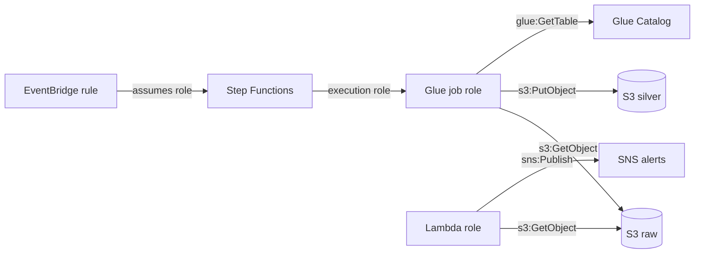

# IAM & STS — Identity and Access for Data Pipelines

## What it is

AWS Identity and Access Management (IAM) is the service that decides **who can do what to which resource** in your AWS account. Everything in AWS — a person, a Glue job, a Lambda function — acts as a *principal*, and every API call it makes is either allowed or denied by IAM policies.

AWS Security Token Service (STS) is IAM's companion: it hands out **temporary credentials**. When a Glue job "assumes a role," STS is what issues the short-lived keys the job actually uses.

Core vocabulary:

| Term | Plain meaning |
|---|---|
| **User** | A permanent identity for a human (avoid for workloads) |
| **Role** | An identity a service or person *assumes* temporarily — the workhorse of data engineering |
| **Policy** | A JSON document listing allowed/denied actions on resources |
| **Principal** | Whoever is making the call |
| **Trust policy** | On a role: *who is allowed to assume me* |
| **Permissions policy** | On a role/user: *what I can do once assumed* |

## Why it exists

Without IAM, anyone with your account could do anything — read all data, delete all buckets. Real organizations need: humans with limited access, workloads with *their own* identities (not shared keys), and an audit trail of who did what. IAM solves the first two; CloudTrail (see [cloudwatch.md](./cloudwatch.md)) records the third.

The engineering problem it solves for data teams specifically: **pipelines run unattended**. A nightly Glue job can't type a password. It needs an identity that exists without a human, has exactly the permissions the job needs, and whose credentials expire automatically. That is an IAM role + STS.

## Where it fits in data engineering

Security — but it is the substrate under *every* stage. Each component of a pipeline runs as a role:



Rule of thumb: **one role per component, scoped to exactly what that component touches.** The Glue job role above can read raw and write silver — it cannot delete buckets, and it cannot write raw (that would break raw's immutability).

## Real data engineering example

The Lab 01 → Lab 03 pipeline needs a Glue job that reads raw CSVs and writes silver Parquet. Its role:

```json
{
  "Version": "2012-10-17",
  "Statement": [
    {
      "Sid": "ReadRawZone",
      "Effect": "Allow",
      "Action": ["s3:GetObject", "s3:ListBucket"],
      "Resource": [
        "arn:aws:s3:::ade-retail-lake-raw-ACCOUNT-REGION",
        "arn:aws:s3:::ade-retail-lake-raw-ACCOUNT-REGION/raw/*"
      ]
    },
    {
      "Sid": "WriteSilverZone",
      "Effect": "Allow",
      "Action": ["s3:PutObject", "s3:ListBucket"],
      "Resource": [
        "arn:aws:s3:::ade-retail-lake-silver-ACCOUNT-REGION",
        "arn:aws:s3:::ade-retail-lake-silver-ACCOUNT-REGION/silver/*"
      ]
    }
  ]
}
```

And its **trust policy** says only the Glue service may assume it:

```json
{
  "Version": "2012-10-17",
  "Statement": [{
    "Effect": "Allow",
    "Principal": { "Service": "glue.amazonaws.com" },
    "Action": "sts:AssumeRole"
  }]
}
```

Notice: no `s3:DeleteObject`, no `s3:*`, no `Resource: "*"`. The job cannot damage anything it does not need to touch.

## How STS fits in

When Glue starts the job, it calls `sts:AssumeRole` on the job role. STS returns an access key, secret key, and session token that expire (typically after 1 hour, renewable). The job signs its S3 calls with those. You use the same mechanism yourself:

```bash
# Who am I right now? (First debugging command for ANY access problem)
aws sts get-caller-identity

# Assume a role manually (e.g. to test what a job role can see)
aws sts assume-role \
  --role-arn arn:aws:iam::123456789012:role/glue-bronze-to-silver \
  --role-session-name debug-session
```

STS also powers **cross-account access** (a role in account B trusts account A) and **OIDC federation** — how GitHub Actions deploys to AWS with no stored secrets (Module 11).

## Basic CLI examples

```bash
# List roles whose name mentions glue
aws iam list-roles --query "Roles[?contains(RoleName, 'glue')].RoleName"

# See what a policy allows
aws iam get-policy-version --policy-arn <arn> --version-id v1

# Simulate: could this role call s3:PutObject on this bucket? (great for debugging)
aws iam simulate-principal-policy \
  --policy-source-arn arn:aws:iam::123456789012:role/glue-bronze-to-silver \
  --action-names s3:PutObject \
  --resource-arns arn:aws:s3:::ade-retail-lake-silver-x-y/silver/test.parquet
```

## How access is actually evaluated

For a single API call, AWS evaluates in this order — knowing it resolves most AccessDenied mysteries:

1. **Explicit Deny anywhere** (identity policy, resource policy, SCP, permission boundary) → denied, always.
2. Otherwise, an **Allow must exist** in the identity policy *or* the resource policy (same-account). Cross-account needs Allow on **both** sides.
3. **KMS is separate:** reading an SSE-KMS encrypted object needs `s3:GetObject` *and* `kms:Decrypt` on the key ([kms.md](./kms.md)).
4. **Lake Formation is another layer:** for governed tables, IAM alone is not enough (Module 08).

## IAM / security notes

- **Least privilege:** grant specific actions on specific resources. `"Action": "s3:*", "Resource": "*"` in a pipeline role is the most common real-world audit finding.
- **No long-lived access keys in code.** Workloads use roles; humans use SSO/Identity Center; CI uses OIDC. If you see `AWS_SECRET_ACCESS_KEY` in a repo, that is an incident.
- **Separate roles per environment** (dev/prod), ideally separate accounts.
- **Permission boundaries and SCPs** cap what even an admin-created role can do — how platform teams let data teams self-serve safely.

## Cost notes

IAM and STS are **free**. The cost of getting IAM wrong is measured in incidents, not dollars: an over-permissive role that lets a buggy job delete a raw zone, or leaked keys that let an attacker mine crypto in your account. Budget alarms (see [account setup](../labs/00-account-setup/)) are your safety net.

## Common mistakes

1. **Using the root user or an admin user for pipelines.** Workloads get their own scoped roles.
2. **`Resource: "*"` "temporarily."** It never gets tightened later. Write the scoped ARN the first time.
3. **Confusing the trust policy with the permissions policy.** "Glue can't assume the role" is a trust policy problem; "the job gets AccessDenied on S3" is a permissions problem.
4. **Forgetting `s3:ListBucket`.** `GetObject` alone often isn't enough — list is a *bucket-level* action with the bucket ARN (no `/*`), and missing it produces confusing 403s.
5. **Forgetting KMS permissions** on encrypted buckets — the bucket policy looks right, but `kms:Decrypt` is missing.
6. **One giant shared "pipeline role"** used by every job — no blast-radius isolation, no meaningful audit trail.

## Troubleshooting

| Symptom | Check | Fix |
|---|---|---|
| `AccessDenied` calling an API | `aws sts get-caller-identity` — are you who you think? Then read the error: it names principal, action, resource | Add that exact action/resource to the role policy |
| `AccessDenied` on `sts:AssumeRole` | The role's **trust policy** | Add the calling service/principal to the trust policy |
| S3 read fails despite S3 policy OK | Is the object SSE-KMS encrypted? | Grant `kms:Decrypt` on the key ([kms.md](./kms.md)) |
| Works for you, fails for the job | You're testing with *your* (broader) permissions | Test with the job's role via `sts assume-role` or the policy simulator |
| Athena/Glue query denied on a governed table | Lake Formation grants missing | Grant in Lake Formation, not just IAM (Module 08) |

## Architect notes

- **Roles are the unit of blast radius.** Design them like you design table schemas: deliberately. One role per job/function; reader vs writer separation per zone (raw is written by ingestion only, read by everyone else).
- **The raw zone's immutability is enforced with IAM**, not convention: no pipeline role gets `s3:DeleteObject` or overwrite rights on raw. Discipline you can't violate beats discipline you remember.
- **Multi-account is the real isolation boundary.** IAM separates identities within an account; accounts separate everything (limits, billing, blast radius). Mature platforms put dev/prod and sometimes each domain in separate accounts with cross-account roles (Module 12).
- **Attribute-based access control (ABAC)** — permissions keyed on tags — scales better than per-resource policies once you have dozens of datasets, and it's the model Lake Formation tags extend to data.

## Interview questions

**Beginner**
1. What is the difference between an IAM user and an IAM role? *(User = permanent identity with long-lived credentials, for humans. Role = assumable identity with temporary STS credentials, for workloads and cross-access.)*
2. What are the two policies every role has? *(Trust policy — who can assume it; permissions policy — what it can do.)*

**Intermediate**
3. A Lambda function gets `AccessDenied` reading `s3://lake/raw/file.csv` even though its policy allows `s3:GetObject` on `arn:aws:s3:::lake/raw/*`. Name two likely causes. *(Missing `s3:ListBucket` if it lists first; SSE-KMS object without `kms:Decrypt`; also possible: explicit deny in bucket policy/SCP.)*
4. How does a Glue job authenticate to S3 with no stored credentials? *(Glue assumes the job's IAM role via STS; temporary credentials are injected and rotated automatically.)*

**Senior / scenario**
5. Design the IAM layout for a raw→silver→gold pipeline shared by three teams. *(Per-job roles; zone-scoped read/write separation; raw write restricted to ingestion roles; no delete on raw; separate accounts or at least permission boundaries per team; ABAC/tags once dataset count grows.)*
6. Your CI/CD needs to deploy CDK stacks. How do you avoid storing AWS keys in GitHub? *(OIDC federation: GitHub Actions exchanges its OIDC token via STS for a role scoped to deployments — no stored secrets, short-lived credentials, repo/branch conditions in the trust policy.)*

## Certification notes (DEA-C01)

Domain 4 (Security & Governance) leans heavily on IAM: least privilege, roles vs users, trust vs permissions policies, cross-account access, and the interaction between IAM, bucket policies, KMS, and Lake Formation. Expect scenario questions of the form "job X gets AccessDenied — what's missing?" where the answer is `ListBucket`, `kms:Decrypt`, or a Lake Formation grant.

---
*Related: [kms.md](./kms.md) · [cloudwatch.md](./cloudwatch.md) (CloudTrail audits IAM activity) · Module 08 (Lake Formation) · Module 11 (OIDC CI/CD)*
