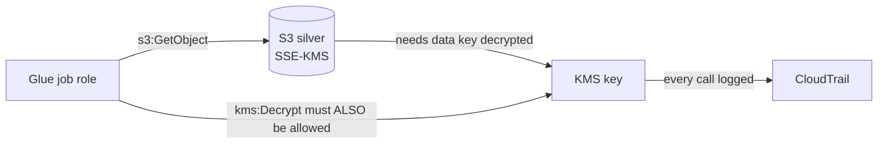

# KMS, Secrets Manager & SSM Parameter Store — Encryption and Configuration

Three services that answer three different questions:

| Service | Question it answers | Typical data-engineering use |
|---|---|---|
| **KMS** | How is data encrypted, and who may use the keys? | Encrypting S3 zones, Redshift, Kinesis, Glue outputs |
| **Secrets Manager** | Where do credentials live, and how do they rotate? | Database passwords for DMS/Glue connections |
| **SSM Parameter Store** | Where does non-secret config live? | Bucket names, table names, feature flags for jobs |

## 1. AWS KMS

### What it is

Key Management Service creates and controls **encryption keys**. You almost never encrypt data with a KMS key directly; services do it for you. When S3 stores an object with SSE-KMS, S3 asks KMS for a *data key*, encrypts the object with it, and stores the data key encrypted by your KMS key (**envelope encryption**). Decrypting requires calling KMS again — which is exactly what makes KMS powerful: **every use of the key is access-controlled and logged**.

### Why it exists

"Encrypt everything" is easy to say, but keys must be stored somewhere, rotated, access-controlled, and audited. KMS centralizes that: keys never leave KMS in plaintext, usage is IAM-and-key-policy controlled, and every `Decrypt` call lands in CloudTrail. For regulated data (finance, health), *who can decrypt* matters as much as *is it encrypted* — KMS is where you enforce it.

### The choice that matters: SSE-S3 vs SSE-KMS

| | **SSE-S3** (S3-managed keys) | **SSE-KMS** (your KMS key) |
|---|---|---|
| Setup | Zero | Create/manage key + key policy |
| Access control on the key | None (bucket access = decrypt) | Yes — separate `kms:Decrypt` permission |
| Audit of decrypt operations | No | Yes, per-call in CloudTrail |
| Cost | Free | $1/key/month + $0.03 per 10k requests (bucket keys reduce this drastically) |
| Use when | Lab/dev, non-sensitive data | PII, regulated data, cross-account sharing, "who decrypted what" audits |

Lab 01's buckets use SSE-S3 for simplicity; the governance module (08) upgrades the sensitive zones to SSE-KMS with a customer-managed key.

### Where it fits + example



The classic failure: the job role has full S3 permissions but no `kms:Decrypt` → `AccessDenied`, and the error often *looks* like an S3 problem. Access to SSE-KMS data always needs **both** the S3 action and the KMS action, and the **key policy** must also allow it.

```bash
# Create a customer-managed key for the lake
aws kms create-key --description "retail-lake silver/gold zone key"
aws kms create-alias --alias-name alias/retail-lake --target-key-id <key-id>

# Encrypt a bucket with it (new objects)
aws s3api put-bucket-encryption --bucket my-silver-bucket \
  --server-side-encryption-configuration '{
    "Rules": [{"ApplyServerSideEncryptionByDefault":
      {"SSEAlgorithm": "aws:kms", "KMSMasterKeyID": "alias/retail-lake"},
      "BucketKeyEnabled": true}]}'
```

`BucketKeyEnabled: true` matters: S3 **bucket keys** cut KMS request costs by ~99% for high-object-count buckets — exactly what a data lake is.

## 2. Secrets Manager

### What it is & why

A vault for credentials: database passwords, API keys. Values are encrypted with KMS, retrieved over IAM-controlled API calls, and — the differentiator — can **rotate automatically** (built-in rotation for RDS/Redshift; Lambda-backed for anything else). It exists because the alternative is passwords in code, environment variables, or wikis, which leak and never rotate.

### Data engineering use

Glue connections, DMS endpoints, and Lambda functions that call APIs all read from Secrets Manager at runtime:

```python
import boto3, json

def get_db_credentials(secret_name: str, region: str) -> dict:
    client = boto3.client("secretsmanager", region_name=region)
    resp = client.get_secret_value(SecretId=secret_name)
    return json.loads(resp["SecretString"])  # {"username": ..., "password": ...}
```

```bash
aws secretsmanager create-secret --name retail/orders-db \
  --secret-string '{"username":"etl_reader","password":"EXAMPLE-ONLY"}'
aws secretsmanager get-secret-value --secret-id retail/orders-db \
  --query SecretString --output text
```

Cost: **$0.40/secret/month + $0.05 per 10k API calls.** Cache secrets in-process (or use the Lambda Secrets extension) instead of fetching per record.

## 3. SSM Parameter Store

### What it is & why

A hierarchical key–value store for **configuration**: `/retail/dev/raw_bucket_name`, `/retail/prod/glue_job_workers`. Standard parameters are **free**; `SecureString` parameters encrypt with KMS. It exists so config lives outside code and per-environment values don't get hardcoded — the same job code reads `/retail/${ENV}/...` in every environment.

```bash
aws ssm put-parameter --name /retail/dev/raw_bucket_name \
  --type String --value ade-retail-lake-raw-123-us-east-1
aws ssm get-parameter --name /retail/dev/raw_bucket_name --query Parameter.Value --output text
aws ssm get-parameters-by-path --path /retail/dev/ --recursive
```

### Secrets Manager vs Parameter Store — the decision

| | **Secrets Manager** | **Parameter Store** |
|---|---|---|
| Automatic rotation | Yes (built-in/Lambda) | No |
| Cost | $0.40/secret/month | Standard tier free |
| Cross-region replication | Built-in | Manual |
| Use for | Credentials that must rotate | Everything else: names, flags, config; low-sensitivity secrets as SecureString if rotation isn't needed |

Simple rule: **rotating credential → Secrets Manager; configuration → Parameter Store.**

## IAM / security notes

- KMS **key policies** are a second, mandatory gate on top of IAM — a key policy that doesn't allow the account's IAM to grant access will lock people out no matter what IAM says. Keep the default account-root statement unless you know why you're removing it.
- Scope `kms:Decrypt` per role per key; a role that can decrypt *every* key defeats the purpose.
- Never put secrets in Glue job arguments, Lambda environment variables (visible in the console), or CDK code. Reference the secret's name/ARN and fetch at runtime.
- Deny-by-default for secret access; grant per-secret ARNs, not `secretsmanager:*`.

## Cost notes

KMS: $1/key/month, $0.03/10k requests — negligible until millions of small objects; then **enable S3 bucket keys**. Secrets Manager: per-secret monthly fee — don't create one secret per environment per developer per whim; structure them. Parameter Store standard tier: free, the default home for config.

## Common mistakes

1. Granting S3 permissions but forgetting **`kms:Decrypt`** (or granting IAM but not the **key policy**).
2. Hardcoding bucket names/credentials instead of Parameter Store/Secrets Manager — makes multi-environment deploys impossible.
3. Fetching a secret on **every record** processed — cache it; you pay per call and add latency.
4. Deleting a KMS key that still encrypts data. Deletion has a 7–30 day waiting period *because data encrypted with it becomes unreadable forever*. Disable, don't delete, until proven unused.
5. Using one KMS key for everything — no blast-radius or access separation between zones/sensitivity levels.

## Troubleshooting

| Symptom | Check | Fix |
|---|---|---|
| `AccessDenied` on S3 GET, S3 policy fine | Object encryption header (`aws s3api head-object`) | Grant `kms:Decrypt` on the key (IAM **and** key policy) |
| `KMSAccessDeniedException` in Glue/Firehose | Service role's KMS permissions | Add `kms:GenerateDataKey`/`Decrypt` for the key |
| Secret not found at runtime | Region — secrets are regional | Fetch from the right region / replicate the secret |
| Throttling on KMS | Request rate vs quota | Enable S3 bucket keys; cache data keys; request quota raise |
| Parameter not visible to job | Path/name and `WithDecryption` for SecureString | Correct the path; add `ssm:GetParameter` + KMS decrypt |

## Architect notes

- **Key strategy = access strategy.** Separate keys per zone or per sensitivity class (e.g. one key for PII datasets) turn "who can read PII" into a single auditable control point. Key-per-dataset is overkill until compliance demands it.
- SSE-KMS + CloudTrail gives you a **decryption audit log** — often the actual compliance requirement behind "encrypt the data."
- Cross-account data sharing with SSE-KMS requires granting the *consumer* account on the key policy — plan this before an account split, not after.
- Parameter Store as the **contract between infra and code**: CDK writes outputs (bucket names) into parameters; jobs read them. No hardcoding, no copy-paste drift.

## Interview questions

1. *(Beginner)* SSE-S3 vs SSE-KMS? *(Both encrypt at rest; SSE-KMS adds your own key, separate decrypt permission, per-call audit, small cost.)*
2. *(Beginner)* Where do you store a database password for a Glue job? *(Secrets Manager; the job role gets `secretsmanager:GetSecretValue` on that secret only.)*
3. *(Intermediate)* What is envelope encryption? *(Data encrypted with a data key; data key encrypted with the KMS key; KMS decrypts the data key on access — keys never leave KMS in plaintext.)*
4. *(Intermediate)* Secrets Manager vs Parameter Store? *(Rotation and built-in replication vs free config store; rotating credentials → Secrets Manager.)*
5. *(Senior)* A lake has 500M small objects under SSE-KMS and the KMS bill exploded. Fix? *(Enable S3 bucket keys — one data key per bucket time-window instead of per object; ~99% fewer KMS calls.)*
6. *(Scenario)* Auditors ask "who could and who did read the PII dataset last quarter?" *(Could: enumerate `kms:Decrypt` + S3/Lake Formation grants on the PII key/tables. Did: CloudTrail KMS Decrypt events + S3 data events / Lake Formation logs.)*

## Certification notes (DEA-C01)

Domain 4 tests: SSE-S3 vs SSE-KMS vs client-side, envelope encryption, key policies vs IAM, Secrets Manager rotation vs Parameter Store, and "job can't read encrypted data" scenarios. Bucket keys appear as the cost answer for KMS-heavy lakes.

---
*Related: [iam.md](./iam.md) · [cloudwatch.md](./cloudwatch.md) (CloudTrail) · Module 08 (governance, Macie, Lake Formation)*
