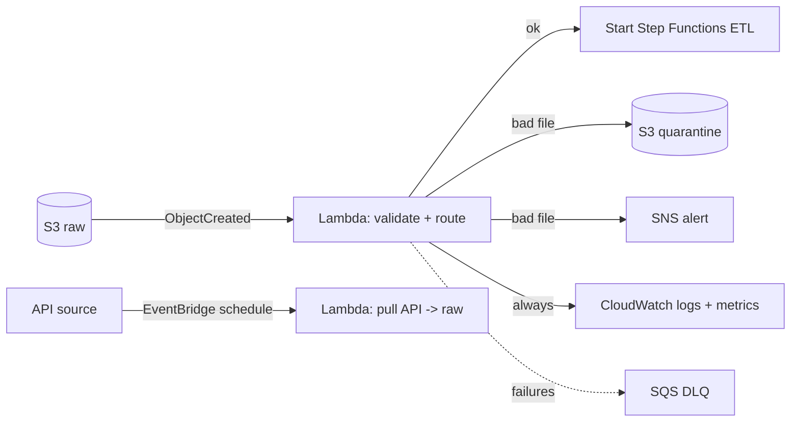

# Lambda — Serverless Functions in Data Pipelines

## What it is

AWS Lambda runs your code (Python, for us) without any server: you upload a function, wire it to a trigger, and AWS runs one copy per concurrent event, billing per millisecond. Hard limits that define what Lambda is for: **15 minutes max runtime, up to 10 GB memory** (CPU scales with memory), 512 MB–10 GB ephemeral `/tmp`, package limits (250 MB unzipped; container images to 10 GB).

## Why it exists

Most pipeline glue is small: validate a file, route an event, call an API, update the catalog, send an alert. Standing up a server (or even a Spark job) for 200 lines of Python is waste. Lambda exists so small units of logic run on demand, scale from 0 to thousands automatically, and cost nothing while idle.

## Where it fits in data engineering

Lambda is the **router and light-transformer** of a pipeline — not the ETL engine:



Good Lambda jobs: file validation/routing on arrival, small API pulls to S3, catalog updates, alert enrichment, Firehose record transforms, Athena query kickoff. Bad Lambda jobs: joins across large tables, anything near 15 minutes, wide aggregations — that's Glue/EMR ([SERVICE-DECISION-FRAMEWORK](../SERVICE-DECISION-FRAMEWORK.md)).

## How it works internally (what actually matters)

- **Cold start:** first invocation in a while creates an execution environment (load runtime, your package, run init code). Python cold starts are typically sub-second; heavy imports (pandas) push it up. Subsequent calls reuse the warm environment — so **initialize clients outside the handler**.
- **Concurrency:** each concurrent event = one environment. A burst of 1,000 S3 events = up to 1,000 concurrent executions (subject to account limits, default 1,000). This is magic until your *downstream* (a database, an API) can't take 1,000 parallel callers — then you add an SQS buffer with limited batch concurrency.
- **Retries:** async invocations (S3, SNS, EventBridge) retry **twice** by default, then discard — unless you configure a DLQ/failure destination. SQS-triggered Lambdas follow the queue's redrive policy instead.
- **At-least-once, again:** every trigger can deliver duplicates. Handlers must be idempotent.

## Real example — the validate-and-route handler

The shape of a production data-pipeline Lambda (see [`src/lambda/handler.py`](../src/lambda/handler.py) for the repo's implementation):

```python
import json
import logging
import os
import urllib.parse

import boto3

logger = logging.getLogger()
logger.setLevel(logging.INFO)
s3 = boto3.client("s3")          # created once per environment, not per event
sns = boto3.client("sns")

REQUIRED_PREFIX = "raw/source=retail/"
ALERT_TOPIC = os.environ["ALERT_TOPIC_ARN"]     # config via env, no hardcoding


def handler(event, context):
    """Validate a landed object; route bad files to quarantine + alert."""
    for record in event["Records"]:
        bucket = record["s3"]["bucket"]["name"]
        key = urllib.parse.unquote_plus(record["s3"]["object"]["key"])
        logger.info("validating s3://%s/%s", bucket, key)

        problems = validate(bucket, key)
        if problems:
            quarantine_key = key.replace("raw/", "quarantine/", 1)
            s3.copy_object(Bucket=bucket, Key=quarantine_key,
                           CopySource={"Bucket": bucket, "Key": key})
            sns.publish(TopicArn=ALERT_TOPIC,
                        Subject=f"Bad file: {key}",
                        Message=json.dumps({"key": key, "problems": problems}))
            logger.warning("quarantined %s: %s", key, problems)
        # Idempotent: re-delivery of the same event re-validates the same
        # object and overwrites the same quarantine key. No duplicates.
    return {"validated": len(event["Records"])}


def validate(bucket: str, key: str) -> list[str]:
    problems = []
    if not key.startswith(REQUIRED_PREFIX):
        problems.append(f"key outside expected prefix {REQUIRED_PREFIX}")
    head = s3.head_object(Bucket=bucket, Key=key)
    if head["ContentLength"] == 0:
        problems.append("empty file")
    if not key.endswith(".csv"):
        problems.append("unexpected file type")
    return problems
```

The details that make it production-grade: client reuse, URL-decoding the key (S3 events URL-encode; `file name.csv` breaks naive handlers), config via environment, structured logging with the key, idempotent writes, and quarantining instead of deleting.

## Deployment + trigger CLI

```bash
# Package and deploy
zip -j function.zip src/lambda/handler.py
aws lambda create-function --function-name validate-upload \
  --runtime python3.12 --handler handler.handler \
  --zip-file fileb://function.zip \
  --role arn:aws:iam::ACCOUNT_ID:role/lambda-validate-upload \
  --environment "Variables={ALERT_TOPIC_ARN=arn:aws:sns:...:pipeline-alerts}" \
  --timeout 60 --memory-size 256

# Invoke manually with a test event
aws lambda invoke --function-name validate-upload \
  --payload file://tests/events/s3_put_orders.json /dev/stdout

# Watch it work
aws logs tail /aws/lambda/validate-upload --follow
```

In this repo, Lambdas deploy via CDK (Lab 05), which also wires the S3/EventBridge trigger and the resource policy that allows S3 to invoke the function.

## IAM / security notes

- Execution role = least privilege: this function needs `s3:GetObject`+`HeadObject` on raw, `s3:PutObject` on quarantine, `sns:Publish` on one topic, plus `logs:*` basics. Nothing else.
- The trigger needs the reverse permission: S3/EventBridge must be allowed to invoke the function (resource-based policy — CDK/console add it; manual setups forget it).
- Secrets via Secrets Manager at runtime, not environment variables ([kms.md](./kms.md)); env vars are visible to anyone who can read the function config.
- VPC-attach only when the function must reach VPC resources (RDS) — it adds ENI cold-start cost and networking failure modes ([vpc.md](./vpc.md)).

## Cost notes

Pay per request ($0.20/million) + GB-seconds (~$0.0000167). A validation function at 256 MB running 2s for 10k files/day ≈ **under $1/month**. Cost traps: over-provisioned memory on chatty functions, runaway retry loops (function fails → retries → fails), recursive triggers (function writes to the bucket that triggers it — same loop as EventBridge), and per-record secret fetches. More memory can be *cheaper* for CPU-bound work — it finishes disproportionately faster; test with power tuning.

## Common mistakes

1. **Using Lambda as an ETL engine** — hitting the 15-min wall on a big file, then "fixing" it with chunking hacks instead of moving to Glue.
2. Creating boto3 clients **inside** the handler — per-invoke overhead.
3. Not URL-decoding S3 event keys.
4. No DLQ/failure destination on async triggers — two silent retries, then the event is gone.
5. Non-idempotent side effects (INSERT instead of upsert; appending instead of overwriting deterministic keys).
6. Unbounded concurrency stampeding a database — buffer with SQS, cap with reserved concurrency.
7. Recursive trigger loops (write target inside trigger scope).

## Troubleshooting

| Symptom | Check | Fix |
|---|---|---|
| Function never fires | Trigger config + resource policy (`aws lambda get-policy`) | Add invoke permission for the event source |
| Timeouts | Duration metric vs timeout; what is it waiting on? | Raise timeout (≤15 min) or move work to Glue; check VPC/S3 connectivity |
| Works in test, fails on real events | Real event shape (URL-encoded keys, batching) | Log the raw event; parse defensively |
| Throttling | Concurrent executions vs account/reserved limit | Raise limits, SQS buffer, or reserved concurrency for critical funcs |
| Duplicate processing | At-least-once delivery | Idempotency (deterministic keys, upserts, dedupe on event id) |
| OOM / disk full | Memory metric; `/tmp` usage | Raise memory/ephemeral storage; stream instead of loading whole file |

## Architect notes

- The 15-minute limit is a **design signal**, not an obstacle: if you're fighting it, the work belongs in Glue/EMR/Batch. Lambda's sweet spot is high-frequency, small-unit, event-shaped work.
- **Concurrency is the contract with downstream systems.** Every Lambda trigger design should answer: what happens when 1,000 arrive at once? (Buffer? Cap? Let it rip to S3, which doesn't care?)
- Keep handlers thin: parsing/validation/routing in Lambda, business transforms in Glue, orchestration in Step Functions. Functions accrete responsibility until they're unmaintainable "pipelines in a handler."
- Package discipline: shared code as a layer or (better) keep functions dependency-light; a function importing pandas+pyarrow to "just check headers" pays cold-start tax forever.

## Interview questions

1. *(Beginner)* What triggers can start a Lambda in a data pipeline? *(S3 events, EventBridge rules/schedules, SQS, SNS, Kinesis, Step Functions, direct invoke.)*
2. *(Beginner)* Why is Lambda a poor fit for large joins? *(15-min/memory limits, no distributed shuffle — that's Spark's job.)*
3. *(Intermediate)* What's a cold start and how do you reduce its impact? *(New environment init; smaller packages, init outside handler, provisioned concurrency for latency-critical paths.)*
4. *(Intermediate)* An async-invoked function failed. What happens to the event? *(Two retries, then discarded unless a DLQ/failure destination is configured.)*
5. *(Senior)* Design file-arrival validation for 50k files/hour with a fragile downstream API. *(S3→SQS→Lambda with batch size + max concurrency capped to the API's budget; DLQ + redrive; idempotent by object key/version.)*
6. *(Scenario)* Your Lambda bill tripled with no traffic change. Where do you look? *(Duration regressions — dependency bloat, waiting on slow downstream; retry loops; recursive trigger; memory misconfig; check per-function cost via Cost Explorer + Duration/Invocations metrics.)*

## Certification notes (DEA-C01)

Domain 1: Lambda for event-driven ingestion/transform, and its limits vs Glue (the "which service transforms this?" scenarios hinge on runtime/size). Domain 3: DLQs, retries, idempotency, concurrency throttling. Know the 15-minute limit cold — it's the exam's favorite disqualifier.

---
*Related: [sqs-sns.md](./sqs-sns.md) · [eventbridge.md](./eventbridge.md) · [step-functions.md](./step-functions.md) · Lab 05 (Lambda S3 trigger) · `src/lambda/handler.py`*
