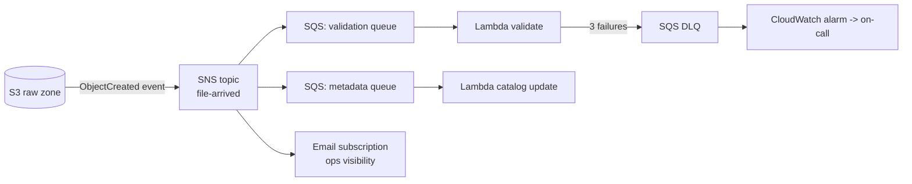

# SQS & SNS — Queues and Notifications for Decoupled Pipelines

Two messaging services with one letter between them and completely different jobs:

| | **SQS** (Simple Queue Service) | **SNS** (Simple Notification Service) |
|---|---|---|
| Model | **Queue** — messages wait to be *pulled* by one consumer | **Topic** — messages are *pushed* to all subscribers |
| Delivery | Each message processed by one worker | Fan-out: every subscriber gets a copy |
| Consumer pace | Consumer's own (buffering, backpressure) | Immediately, push |
| Retention | Up to 14 days | No storage — delivered or gone (per-subscriber retry/DLQ) |
| Data eng use | Buffer file-arrival events, decouple stages, DLQs | Alerts to humans, fan-out one event to many pipelines |

Memory hook: **SQS = to-do list. SNS = megaphone.**

## Why they exist

Directly coupling producers to consumers fails in two classic ways. If the consumer is down or slow, events are lost or the producer blocks — a **queue** absorbs the mismatch. If tomorrow *three* systems need the same event, the producer must know them all — a **topic** inverts that: producers publish once, subscribers come and go.

## Where they fit in data engineering

Ingestion buffering, decoupling between stages, failure handling (DLQs), and alerting:



This **SNS → SQS fan-out** is the canonical pattern: S3 can only send an event notification to one place per prefix/event-type, so send it to a topic once and let any number of queues subscribe. Each consumer gets its own queue — its own pace, its own retry, its own DLQ.

## The concepts that matter in production

- **Visibility timeout (SQS):** when a worker takes a message, it becomes invisible for N seconds. If the worker crashes and never deletes it, it reappears for another worker. This is *at-least-once delivery* — which means **consumers must be idempotent** (processing the same file-event twice must be safe; deterministic S3 keys and upserts make it so).
- **Dead-letter queue (DLQ):** after `maxReceiveCount` failed attempts, SQS moves the message to a DLQ instead of retrying forever. Without a DLQ, a poison message (malformed file event) loops forever, burning compute and blocking real work. **Every production queue and every async Lambda gets a DLQ + alarm on its depth.**
- **Standard vs FIFO:** Standard = near-unlimited throughput, at-least-once, best-effort order. FIFO = strict order + exactly-once *within a message group*, at lower throughput. Data pipelines rarely need FIFO — order usually comes from data (timestamps), not the transport. Choose FIFO only when processing order is a real correctness requirement (e.g. CDC events per key — and even then DMS/Kinesis are likelier tools).
- **Long polling:** set `WaitTimeSeconds=20` on receive — fewer empty responses, lower cost, faster pickup. There is almost no reason to short-poll.

## Real example + CLI

```bash
# Queue with a DLQ
aws sqs create-queue --queue-name file-events-dlq
DLQ_ARN=$(aws sqs get-queue-attributes \
  --queue-url $(aws sqs get-queue-url --queue-name file-events-dlq --query QueueUrl --output text) \
  --attribute-names QueueArn --query Attributes.QueueArn --output text)

aws sqs create-queue --queue-name file-events --attributes "{
  \"RedrivePolicy\": \"{\\\"deadLetterTargetArn\\\":\\\"$DLQ_ARN\\\",\\\"maxReceiveCount\\\":\\\"3\\\"}\",
  \"VisibilityTimeout\": \"120\",
  \"ReceiveMessageWaitTimeSeconds\": \"20\"
}"

# Alert topic with an email subscription
aws sns create-topic --name pipeline-alerts
aws sns subscribe --topic-arn arn:aws:sns:us-east-1:ACCOUNT_ID:pipeline-alerts \
  --protocol email --notification-endpoint you@example.com   # confirm via email!
aws sns publish --topic-arn arn:aws:sns:us-east-1:ACCOUNT_ID:pipeline-alerts \
  --subject "Glue job failed" --message "bronze_to_silver_orders failed for 2026-07-01"
```

Consumer sketch (idempotent, explicit delete):

```python
import boto3, json
sqs = boto3.client("sqs")

def poll(queue_url: str) -> None:
    resp = sqs.receive_message(QueueUrl=queue_url, MaxNumberOfMessages=10,
                               WaitTimeSeconds=20)
    for msg in resp.get("Messages", []):
        body = json.loads(msg["Body"])
        process_file_event(body)          # MUST be safe to run twice
        sqs.delete_message(QueueUrl=queue_url,          # delete = "done"
                           ReceiptHandle=msg["ReceiptHandle"])
```

## IAM / security notes

- **Resource policies** are how services publish to your topic/queue: S3 needs permission on the SNS topic policy; SNS needs `sqs:SendMessage` on each subscribed queue's policy. Missing these = silent non-delivery (the most common integration bug).
- Encrypt both with KMS (SSE) for sensitive payloads — but prefer sending *references* (bucket/key) over data.
- Scope consumer roles to their one queue: `sqs:ReceiveMessage`, `sqs:DeleteMessage`, `sqs:GetQueueAttributes` on the queue ARN.

## Cost notes

Both are cheap and pay-per-request: SQS ~$0.40/million requests (long polling reduces requests), SNS ~$0.50/million publishes + delivery costs for some protocols. The real cost trap is *architectural*: a consumer that fetches-and-fails in a tight retry loop pays for every cycle — DLQs cap that.

## Common mistakes

1. **No DLQ** → poison message loops forever.
2. **Non-idempotent consumers** on at-least-once delivery → duplicate rows downstream.
3. Visibility timeout **shorter than processing time** → the same message is processed concurrently by two workers (looks like mystery duplicates).
4. Deleting the message **before** processing succeeds → data loss on crash.
5. Expecting SNS to store messages — subscriber down without a queue in front = missed events. Fan out to SQS when you can't afford misses.
6. SNS→SQS subscription without **raw message delivery** consideration: the SQS body is an SNS envelope (JSON-in-JSON) unless you enable `RawMessageDelivery`. Half of "my parser broke" bugs.
7. Choosing FIFO "to be safe" and hitting throughput ceilings.

## Troubleshooting

| Symptom | Check | Fix |
|---|---|---|
| Messages published, queue empty | Queue policy allows SNS `sqs:SendMessage`? Subscription confirmed? | Fix the queue's resource policy; confirm subscription |
| Duplicates downstream | Visibility timeout vs processing time; consumer idempotency | Raise timeout; make processing idempotent |
| Messages vanish unprocessed | Someone/something else consuming? Delete-before-process bug? | One consumer app per queue; delete only after success |
| DLQ filling | Read actual message bodies from DLQ | Fix the poison-message cause, then redrive (`start-message-move-task`) |
| Email alerts not arriving | Subscription status pending? | Confirm the subscription link; check spam |
| Lambda not triggered by queue | Event source mapping enabled? Batch size? Function errors? | Fix mapping/permissions; check Lambda DLQ/failures |

## Architect notes

- **Queues are where you make failure explicit.** A DLQ depth alarm converts "silent data loss" into a ticket with the exact failing payloads attached. Design the redrive path (fix, replay from DLQ) as part of the pipeline, not an afterthought.
- **SNS→SQS→Lambda beats S3→Lambda direct** once more than one consumer exists or you need buffering/retry control — and it costs almost nothing extra to start that way. S3→EventBridge is the more powerful modern alternative when you need filtering/routing ([eventbridge.md](./eventbridge.md)).
- SQS is a *work buffer*, not an event **stream**: no replay after delete, no multiple independent readers of the same message history. Replay/multi-consumer/ordering-at-scale requirements point to Kinesis/Kafka (Module 05).
- Backpressure by design: queue depth is your natural scaling signal (Lambda scales on it automatically).

## Interview questions

1. *(Beginner)* SQS vs SNS in one sentence each? *(Queue you pull from with one processor per message; topic that pushes copies to all subscribers.)*
2. *(Beginner)* What is a DLQ for? *(Isolate messages that repeatedly fail so they don't retry forever, and make failures visible/replayable.)*
3. *(Intermediate)* Why must SQS consumers be idempotent? *(At-least-once delivery — crashes after processing but before delete cause redelivery.)*
4. *(Intermediate)* What does visibility timeout do, and what happens if it's too short? *(Hides in-flight messages; too short → concurrent duplicate processing.)*
5. *(Senior)* One S3 event must feed validation, cataloging, and an audit log, each failing independently. Design it. *(S3 → SNS topic → three SQS queues (raw delivery) → three consumers, each with own DLQ+alarm; idempotent handlers keyed on bucket/key/version.)*
6. *(Scenario)* When would you pick Kinesis over SQS for ingestion? *(Need replay, multiple independent consumers of the same stream, ordering per key at high throughput, or stream analytics — SQS deletes on consume and can't replay.)*

## Certification notes (DEA-C01)

Expect: SQS-vs-SNS-vs-Kinesis selection scenarios (buffering vs fan-out vs replayable stream), DLQs as the resilience answer, visibility-timeout duplicate scenarios, and idempotency as a Domain 1 "programming concepts" theme.

---
*Related: [eventbridge.md](./eventbridge.md) · [lambda.md](./lambda.md) · Module 05 (Kinesis) · [cloudwatch.md](./cloudwatch.md) (DLQ alarms)*
