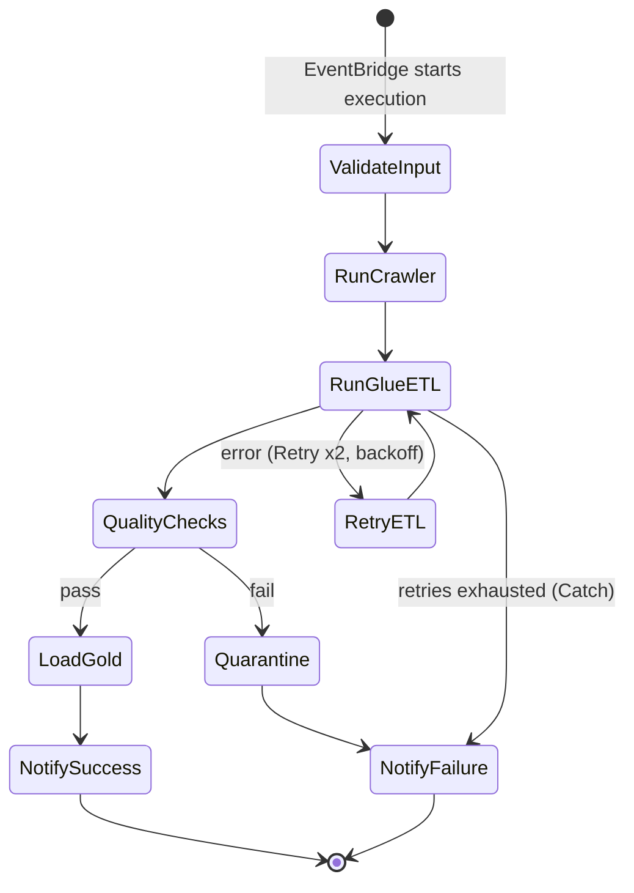

# Step Functions — Orchestrating Pipelines as State Machines

## What it is

AWS Step Functions runs **workflows**: you define states (steps) in JSON (Amazon States Language, ASL) or the CDK, and the service executes them in order, with branching, parallelism, retries, error handling, and a visual execution history. Each execution is durable — it survives the failure of any single step and remembers exactly where it was.

Two flavors:

| | **Standard** | **Express** |
|---|---|---|
| Max duration | 1 year | 5 minutes |
| Pricing | Per state transition | Per request + duration |
| Semantics | Exactly-once workflow progress | At-least-once |
| Use for | Batch ETL orchestration (our case) | High-volume, short event processing |

## Why it exists

A real pipeline is never one job. It's "crawl, then transform, then quality-check, then load — and if quality fails, quarantine and alert; and retry the transform twice before giving up." Encoding that in cron + bash + hope is how 3am pages happen. Step Functions exists so **the control flow itself is a managed, observable, retryable artifact** — not logic buried in scripts.

## Where it fits in data engineering

Orchestration. It's the conductor between the trigger layer (EventBridge) and the workers (Glue, Lambda, Athena, ECS):



Key superpower for data work: **optimized integrations with `.sync`**. `glue:startJobRun.sync` starts a Glue job and *waits for it to finish* — no polling Lambda, no wait loops. Same for Athena queries, EMR steps, and nested workflows.

## The ASL that matters

A condensed real pipeline definition (full version ships with Lab 07):

```json
{
  "StartAt": "RunGlueETL",
  "States": {
    "RunGlueETL": {
      "Type": "Task",
      "Resource": "arn:aws:states:::glue:startJobRun.sync",
      "Parameters": {
        "JobName": "bronze_to_silver_orders",
        "Arguments": {
          "--INGESTION_DATE.$": "$.ingestion_date"
        }
      },
      "Retry": [{
        "ErrorEquals": ["Glue.ConcurrentRunsExceededException", "States.TaskFailed"],
        "IntervalSeconds": 60, "MaxAttempts": 2, "BackoffRate": 2.0
      }],
      "Catch": [{
        "ErrorEquals": ["States.ALL"],
        "ResultPath": "$.error",
        "Next": "NotifyFailure"
      }],
      "Next": "QualityChecks"
    },
    "QualityChecks": {
      "Type": "Task",
      "Resource": "arn:aws:states:::lambda:invoke",
      "Parameters": { "FunctionName": "run-quality-checks",
                      "Payload": { "date.$": "$.ingestion_date" } },
      "ResultSelector": { "passed.$": "$.Payload.passed" },
      "ResultPath": "$.quality",
      "Next": "QualityGate"
    },
    "QualityGate": {
      "Type": "Choice",
      "Choices": [{ "Variable": "$.quality.passed", "BooleanEquals": true,
                    "Next": "NotifySuccess" }],
      "Default": "NotifyFailure"
    },
    "NotifySuccess": { "Type": "Task",
      "Resource": "arn:aws:states:::sns:publish",
      "Parameters": { "TopicArn": "arn:aws:sns:REGION:ACCOUNT:pipeline-alerts",
                      "Message.$": "$" }, "End": true },
    "NotifyFailure": { "Type": "Task",
      "Resource": "arn:aws:states:::sns:publish",
      "Parameters": { "TopicArn": "arn:aws:sns:REGION:ACCOUNT:pipeline-alerts",
                      "Message.$": "$" }, "End": true }
  }
}
```

The concepts to internalize:

- **Input/output paths** (`$`, `ResultPath`, `ResultSelector`): each state receives JSON and passes JSON on. Most real-world Step Functions bugs are path bugs — a state overwrote the input, or read a field that isn't there.
- **Retry/Catch per state**: retry *transient* errors (throttling, concurrency) with backoff; catch *permanent* ones and route to failure handling. A workflow with no Catch blocks is a demo, not a pipeline.
- **Choice** states are your quality gates and branch points.
- **Map** state fans out over a list (e.g. run per-entity ETL in parallel; Distributed Map scales to millions of items — S3 object listings included).

## CLI: run, watch, debug

```bash
# Start an execution (idempotency: name it after the work unit!)
aws stepfunctions start-execution \
  --state-machine-arn arn:aws:states:us-east-1:ACCOUNT_ID:stateMachine:retail-pipeline \
  --name "orders-2026-07-01" \
  --input '{"ingestion_date": "2026-07-01"}'

# List failed executions
aws stepfunctions list-executions --state-machine-arn <arn> --status-filter FAILED

# Full step-by-step history of one execution (what failed, with what error)
aws stepfunctions get-execution-history --execution-arn <arn> \
  --query "events[?type=='TaskFailed' || type=='ExecutionFailed']"
```

Naming executions after the work unit (`orders-2026-07-01`) gives you free duplicate suppression on Standard workflows: starting the same name+input while one is running/recently-succeeded is rejected — a cheap idempotency layer for event-triggered pipelines.

## IAM / security notes

- The state machine's **execution role** needs permission for every task it starts (`glue:StartJobRun`, `lambda:InvokeFunction`, `sns:Publish`…) — plus, for `.sync` integrations, the events/`glue:GetJobRun` permissions the polling machinery uses (CDK wires this; hand-rolled roles often miss it).
- Execution input/output is visible in the console and history — **no secrets or PII in state payloads**; pass references.
- Whoever can `states:StartExecution` can run your pipeline — scope it to the EventBridge role and operators.

## Cost notes

Standard: **$25 per million state transitions** — a 10-state pipeline running hourly ≈ 7,300 transitions/month ≈ nothing. Cost traps: polling loops implemented as Wait+Choice+Lambda cycles (each lap = transitions + Lambda) — use `.sync` integrations or callbacks instead; and very high-frequency Standard executions that should be Express. Compared with MWAA (Airflow) — always-on environment at hundreds of $/month — Step Functions is usually the cheap option for AWS-native pipelines ([SERVICE-DECISION-FRAMEWORK](../SERVICE-DECISION-FRAMEWORK.md)).

## Common mistakes

1. **No Retry/Catch** — one transient Glue throttle kills the nightly run.
2. Retrying **permanent** errors (bad data, missing table) 5 times with backoff — 40 minutes of delay to reach the same failure.
3. **Path bugs** — clobbering state with `ResultPath: "$"` (the default!) when you meant to append.
4. Polling with Lambda instead of `.sync`/callbacks.
5. Orchestrating *inside* a Lambda (function calls function calls function) — invisible, un-retryable, 15-min-limited. If a Lambda's main job is calling other services in order, it should be a state machine.
6. Not naming executions → duplicate concurrent runs for the same partition, corrupting each other's output.
7. Treating the state machine as a data plane — passing megabytes of records through state payloads (256 KB limit; pass S3 references).

## Troubleshooting

| Symptom | Check | Fix |
|---|---|---|
| Execution fails at a task | Visual graph → red state → error + cause | Fix the underlying task; add Catch routing |
| `States.Runtime` path error | Input/output of the failing state in history | Fix JSONPath; use ResultSelector/ResultPath deliberately |
| Task "succeeds" but workflow hangs | `.sync` permissions (GetJobRun, events rules) | Grant the sync-polling permissions |
| AccessDenied starting a task | Execution role vs the task's API | Add the specific action to the execution role |
| Same partition processed twice | Execution naming + trigger duplicates | Name executions by work unit; idempotent tasks |
| Payload too large | State output sizes | Pass S3 URIs, not data |

## Architect notes

- **Orchestration vs choreography:** Step Functions = central conductor (visible, debuggable, single place to reason about the flow); pure event chains (S3→Lambda→S3→Lambda) = choreography (loosely coupled, but the *pipeline* exists only in your head). Rule of thumb: choreograph between *domains*, orchestrate within a *pipeline*.
- **The state machine is the pipeline's documentation.** A well-named ASL definition in git tells a new engineer exactly what runs, in what order, with what failure handling — better than any wiki page.
- Step Functions vs MWAA/Airflow: choose Airflow for large existing DAG codebases, complex Python-defined dynamic DAGs, and its operator ecosystem across non-AWS systems; choose Step Functions for AWS-native pipelines where serverless cost, IAM-native security, and per-state retries win. Many shops run both — Airflow as the enterprise scheduler, Step Functions inside AWS-heavy pipelines.
- Design for **partial re-run**: parameterize by partition (`ingestion_date`), keep tasks idempotent, and a failed nightly run is fixed by re-executing with the same input — no manual cleanup.

## Interview questions

1. *(Beginner)* What problem does Step Functions solve that cron doesn't? *(Dependencies, branching, retries, error routing, visibility, durable state.)*
2. *(Beginner)* Standard vs Express? *(Year-long exactly-once orchestration vs 5-min at-least-once high-volume; batch ETL = Standard.)*
3. *(Intermediate)* How do you run a Glue job and wait for completion without polling code? *(`glue:startJobRun.sync` optimized integration.)*
4. *(Intermediate)* Retry vs Catch? *(Retry re-attempts the same state on matching errors with backoff; Catch routes to a fallback state when retries are exhausted or the error is permanent.)*
5. *(Senior)* Design the error handling for crawl→transform→quality→load. *(Per-state Retry for transient errors with backoff+jitter; Catch → quarantine/alert states with `ResultPath` preserving the error; quality gate as Choice; idempotent tasks so the whole execution can be re-run per partition; execution naming for dedupe; alarm on ExecutionsFailed.)*
6. *(Scenario)* A Map state fans out 200 parallel Glue jobs and everything throttles. *(Cap Map `MaxConcurrency` to the Glue concurrency budget; Retry on ConcurrentRunsExceeded with backoff; consider batching entities per job.)*

## Certification notes (DEA-C01)

Domains 1 & 3: choosing Step Functions vs EventBridge vs Glue Workflows vs MWAA; `.sync` integrations; Retry/Catch semantics; Map for fan-out; and "pipeline must not lose progress on step failure" scenarios. Express-vs-Standard shows up as a semantics/cost question.

---
*Related: [eventbridge.md](./eventbridge.md) (what triggers it) · [lambda.md](./lambda.md) (what it invokes) · Module 06 (orchestration deep-dive) · Lab 07*
