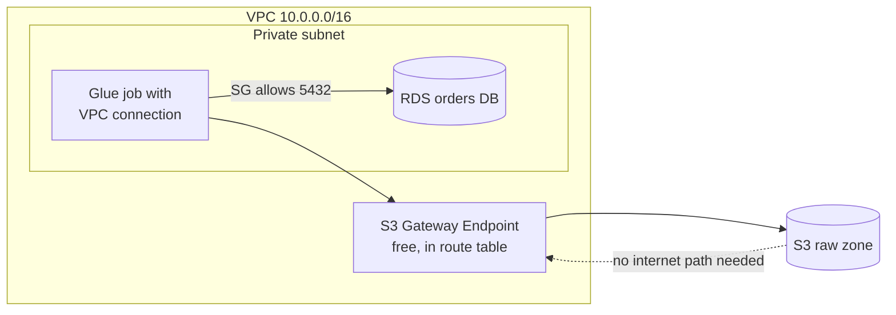

# VPC, Security Groups & NACLs — Networking for Data Pipelines

## What it is

A Virtual Private Cloud (VPC) is your own private network inside AWS: a block of IP addresses (e.g. `10.0.0.0/16`) divided into **subnets**, with routing rules you control. Resources that live "in a network" — RDS databases, Redshift provisioned clusters, EMR nodes, Glue connections to databases — sit inside a VPC.

Two firewall layers protect traffic:

| | **Security Group (SG)** | **Network ACL (NACL)** |
|---|---|---|
| Attaches to | A resource's network interface (ENI) | A subnet |
| State | **Stateful** — reply traffic is auto-allowed | **Stateless** — must allow both directions |
| Rules | Allow only | Allow and Deny |
| Evaluation | All rules evaluated | Rules in number order, first match wins |
| Typical use | Primary, per-resource firewall — use this 95% of the time | Coarse subnet guardrails, explicit blocks |

## Why it exists

Databases and clusters must not be reachable from the internet. A VPC gives you private IP space, and lets you decide which subnets can reach the internet (public, via an Internet Gateway) versus which cannot (private). The engineering problem for data teams: **your pipeline compute must reach data stores privately, without exposing either to the outside.**

## Where it fits in data engineering

Networking touches data engineering less than you'd expect — and knowing exactly *where* is the skill:

- **S3, Athena, Glue Catalog, Kinesis, DynamoDB** are **regional services with public endpoints** — they do not live in your VPC. A plain Glue S3→S3 job needs no VPC at all.
- You need VPC networking when a pipeline touches something *inside* a network: reading from **RDS/Aurora** (Glue connection), **Redshift provisioned**, **EMR** clusters, or on-prem sources via VPN/Direct Connect.
- **VPC endpoints** let resources in private subnets reach AWS services without internet: a **Gateway endpoint** (free) for S3/DynamoDB, **Interface endpoints** (PrivateLink, paid per-hour+GB) for most other services.



## Real data engineering example

A Glue job must pull from a Postgres RDS in a private subnet and land data in S3:

1. Create a **Glue connection** pointing at the RDS endpoint; Glue attaches ENIs in the same VPC/subnet.
2. The RDS **security group** allows inbound 5432 *from the Glue connection's security group* (SG-to-SG reference — no IP lists to maintain).
3. The Glue connection's SG allows **all outbound**, and — a famous quirk — needs a **self-referencing inbound rule** (all TCP from itself) so Glue workers can talk to each other.
4. Add an **S3 Gateway endpoint** to the private subnet's route table so the job can write to S3 with no NAT gateway.

Without step 4, the job either fails to reach S3 or you pay for a NAT gateway (~$32/month + per-GB) to route S3 traffic through the internet path — a pure waste.

## Basic CLI examples

```bash
# See your VPCs and subnets
aws ec2 describe-vpcs --query "Vpcs[].{id:VpcId,cidr:CidrBlock}"
aws ec2 describe-subnets --query "Subnets[].{id:SubnetId,az:AvailabilityZone,cidr:CidrBlock}"

# What does this security group allow?
aws ec2 describe-security-groups --group-ids sg-0123456789abcdef0 \
  --query "SecurityGroups[].IpPermissions"

# Create a free S3 gateway endpoint
aws ec2 create-vpc-endpoint \
  --vpc-id vpc-0123 --service-name com.amazonaws.us-east-1.s3 \
  --route-table-ids rtb-0456
```

## IAM / security notes

- **Private subnets by default** for anything holding data. Public subnets are for load balancers and NAT, not databases.
- **SG-to-SG rules, not CIDR rules**, between your own components — they survive IP changes and self-document intent.
- A VPC endpoint can carry an **endpoint policy** — e.g. "this VPC may only reach *our* buckets," which blocks exfiltration to an attacker's bucket even if compute is compromised.
- Network controls complement, never replace, IAM: a stolen credential works from anywhere unless policies also restrict by network (`aws:SourceVpce` conditions).

## Cost notes

- VPCs, subnets, SGs, NACLs, route tables, **gateway endpoints: free**.
- **NAT gateways cost real money** (hourly + per-GB) and are the classic silent bill in data platforms — a Glue job routing terabytes to S3 through NAT pays per GB for nothing. Gateway endpoint fixes it for free.
- **Interface endpoints** cost per-AZ-hour + per-GB; add them for the services you actually call privately, not all of them.
- Cross-AZ traffic costs per-GB — co-locate chatty components where sensible.

## Common mistakes

1. **Putting everything in a VPC "for security"** — Glue S3→S3 jobs in a VPC gain nothing and inherit networking failure modes.
2. **Missing self-referencing SG rule on Glue connections** — the most common cause of Glue-to-RDS connection failures.
3. **No S3 endpoint in a private subnet** — jobs hang reaching S3, or you pay NAT per-GB.
4. **Opening 0.0.0.0/0 inbound to a database** "to make it work." Never.
5. **Debugging NACLs first.** Default NACLs allow everything; the problem is almost always the SG or routing. Check NACLs only if someone customized them.
6. **Forgetting DNS settings** (`enableDnsSupport`/`enableDnsHostnames`) breaks interface endpoints and RDS hostname resolution.

## Troubleshooting

| Symptom | Check | Fix |
|---|---|---|
| Glue job can't reach RDS | Connection test in Glue console; RDS SG inbound; self-ref rule on Glue SG | Allow DB port from Glue SG; add self-referencing rule |
| Job in private subnet times out on S3 | Route table for the subnet | Add S3 gateway endpoint (or NAT if internet truly needed) |
| Connection works one AZ, fails in another | Subnet/AZ of the endpoint or connection | Provision endpoints/subnets in all AZs the job uses |
| "Network interface limit exceeded" | ENI quota — Glue/Lambda in VPC consume ENIs | Raise quota or reduce concurrent VPC-attached workers |
| Intermittent timeouts, SGs correct | Custom NACL (stateless — return traffic blocked) | Allow ephemeral ports (1024–65535) outbound/inbound as needed |

## Architect notes

- **Keep data pipelines out of VPCs unless a resource forces them in.** Every VPC attachment adds ENIs, IP consumption, endpoints, and failure modes. Serverless-on-regional-services (S3/Glue/Athena/Kinesis) is simpler and just as secure with IAM + encryption.
- When you do need VPCs, **standardize one pattern**: private subnets across 2–3 AZs, gateway endpoints for S3/DynamoDB, interface endpoints for the short list of services used privately, no NAT unless a job genuinely needs the internet.
- **IP exhaustion is real** at scale — EMR and VPC-attached Glue eat addresses. Size CIDRs generously; carve subnets per workload class.
- In multi-account platforms, **centralize networking** (Transit Gateway, shared VPCs) and keep data accounts' networking minimal (Module 12).

## Interview questions

**Beginner**
1. Security group vs NACL? *(SG: stateful, resource-level, allow-only. NACL: stateless, subnet-level, allow+deny, ordered rules.)*
2. Does S3 live inside your VPC? *(No — regional service with public endpoints; a VPC endpoint gives private access to it.)*

**Intermediate**
3. A Glue job in a private subnet must write to S3 with no internet access. How? *(S3 gateway endpoint in the subnet's route table — free, keeps traffic on the AWS network.)*
4. Why do Glue connections need a self-referencing security group rule? *(Glue workers communicate with each other; the rule allows intra-SG traffic.)*

**Senior / scenario**
5. Your AWS bill shows large NAT gateway data-processing charges from the analytics account. Diagnose. *(Pipeline compute in private subnets is reaching S3/other AWS services via NAT; add gateway/interface endpoints and route AWS-service traffic off the NAT.)*
6. How would you prevent compromised pipeline compute from exfiltrating data to an attacker's bucket? *(S3 endpoint policy restricting to approved buckets; bucket policies with `aws:SourceVpce`; egress-controlled subnets; SCPs.)*

## Certification notes (DEA-C01)

Networking appears mainly as: VPC endpoints for private S3 access (gateway vs interface), Glue connections to VPC databases, and security-group reasoning for Redshift/RDS access. Know that gateway endpoints are free and S3/DynamoDB-only — a frequent cost-optimization answer.

---
*Related: [iam.md](./iam.md) · [kms.md](./kms.md) · Module 03 (DMS/ingestion from databases) · Module 07 (Redshift networking)*
