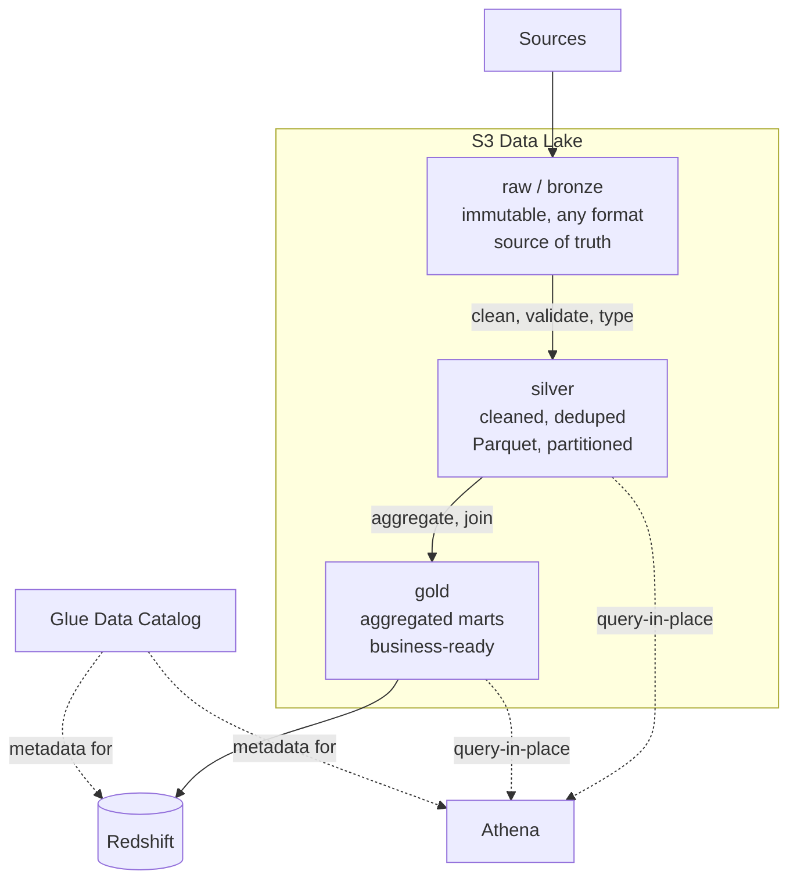

# 02 · Storage & the S3 Data Lake

> The floor of almost every AWS data platform is S3. Get the storage layer right — zones, partitioning, formats, lifecycle — and everything downstream (Glue, Athena, Redshift) is cheaper and faster. Get it wrong and you inherit a "data swamp" that no amount of clever compute fixes. This module is that foundation.

**Cert domain:** 2 · Data Store Management (~26%)
**Lab:** [Lab 01 — Build an S3 Data Lake](../labs/lab-01-s3-data-lake/) (fully runnable)

---

## Beginner explanation

Imagine a giant, cheap, near-infinite hard drive in the cloud where you drop files and they never get lost. That's Amazon S3. A **data lake** is just a disciplined way of organizing files on that drive so that, later, tools can read them fast and cheaply. The discipline is: keep the original data untouched (raw), make cleaned copies (silver), and make business-ready summaries (gold). That layered pattern is called the **medallion architecture**.

## Real-world example

A retailer drops daily `orders.csv`, `customers.csv`, and `products.csv` into S3. Raw keeps them exactly as received (so you can always replay). A Glue job cleans and joins them into partitioned Parquet in silver. Another job aggregates daily sales-by-region into gold, which Redshift and BI dashboards read. Same data, three zones, each optimized for its job.

## AWS services involved

Amazon S3 (storage), Glue Data Catalog (metadata), Athena (query-in-place), and — as the table format for reliable lakes — Apache Iceberg. Lifecycle policies, versioning, encryption (KMS), and event notifications are S3 features you'll use throughout.

## Architecture — the medallion zones

## AWS icon diagram instruction

For a polished version of the diagram above using official AWS icons, use draw.io with the AWS shape library (S3 bucket icons per zone, Athena, Glue Catalog, Redshift). See [`docs/aws-icons/`](../docs/aws-icons/) for how to get and use the official icon set; save the `.drawio` source and a PNG export in [`docs/diagrams/`](../docs/diagrams/).

## Code links

- CDK stack that builds the zoned lake: [`infra/cdk/stacks/s3_data_lake_stack.py`](../infra/cdk/stacks/s3_data_lake_stack.py)
- Upload / validate scripts: [`scripts/`](../scripts/)
- Tests: [`tests/unit/test_s3_key_layout.py`](../tests/unit/test_s3_key_layout.py), [`test_sample_data_schema.py`](../tests/unit/test_sample_data_schema.py)

## Lab link

[Lab 01 — Build an S3 Data Lake with Bronze, Silver, and Gold Zones](../labs/lab-01-s3-data-lake/) — deploy the buckets, upload partitioned data, validate, and clean up.

## Certification mapping

Domain 2 tests data-store selection and management: S3 storage classes and lifecycle, partitioning strategy, file formats (Parquet/Iceberg), the Glue Data Catalog, and cost implications of layout. The Athena "billed per byte scanned" fact and partition pruning are frequent scenario hooks. → [CERTIFICATION-MAPPING](../CERTIFICATION-MAPPING.md#domain-2--data-store-management-26)

## Architect-level trade-offs

Covered in depth in [`concept.md`](./concept.md) and [`architecture.md`](./architecture.md): zone count, partition granularity, one-bucket-vs-many, and when a plain Parquet lake should become an Iceberg lakehouse.

## Common production failures

The small-files problem, over-partitioning, unpartitioned Athena scans blowing up cost, schema drift breaking crawlers, and treating raw as mutable. Fixes in [`troubleshooting.md`](./troubleshooting.md).

---

## Files in this module

| File | What it covers |
|---|---|
| [concept.md](./concept.md) | S3 first principles, storage types, zones, formats, the small-files problem |
| [architecture.md](./architecture.md) | Zone flow, partition pruning, ingestion flow — with diagrams |
| [code-walkthrough.md](./code-walkthrough.md) | The CDK stack and scripts, line by line |
| [deployment.md](./deployment.md) | Deploy the lake with CDK, exact commands |
| [security.md](./security.md) | Encryption, block-public-access, versioning, least privilege |
| [cost.md](./cost.md) | Storage classes, lifecycle, scan-cost levers |
| [troubleshooting.md](./troubleshooting.md) | Small files, partitions not showing, scan cost, schema drift |
| [monitoring.md](./monitoring.md) | Freshness alarms, Storage Lens, Inventory, access logs |
| [mistakes-to-avoid.md](./mistakes-to-avoid.md) | The ten storage mistakes that create data swamps |
| [service-decision.md](./service-decision.md) | The seven storage-layer design decisions, with links to full comparisons |
| [hands-on-lab.md](./hands-on-lab.md) | Quick-reference command sequence for Lab 01 |
| [industry-use-cases.md](./industry-use-cases.md) | How the same lake machinery is arranged per industry |
| [certification-notes.md](./certification-notes.md) | DEA-C01 Domain 2 facts, scenario patterns, and traps |
| [interview-questions.md](./interview-questions.md) | Beginner → architect Q&A |
