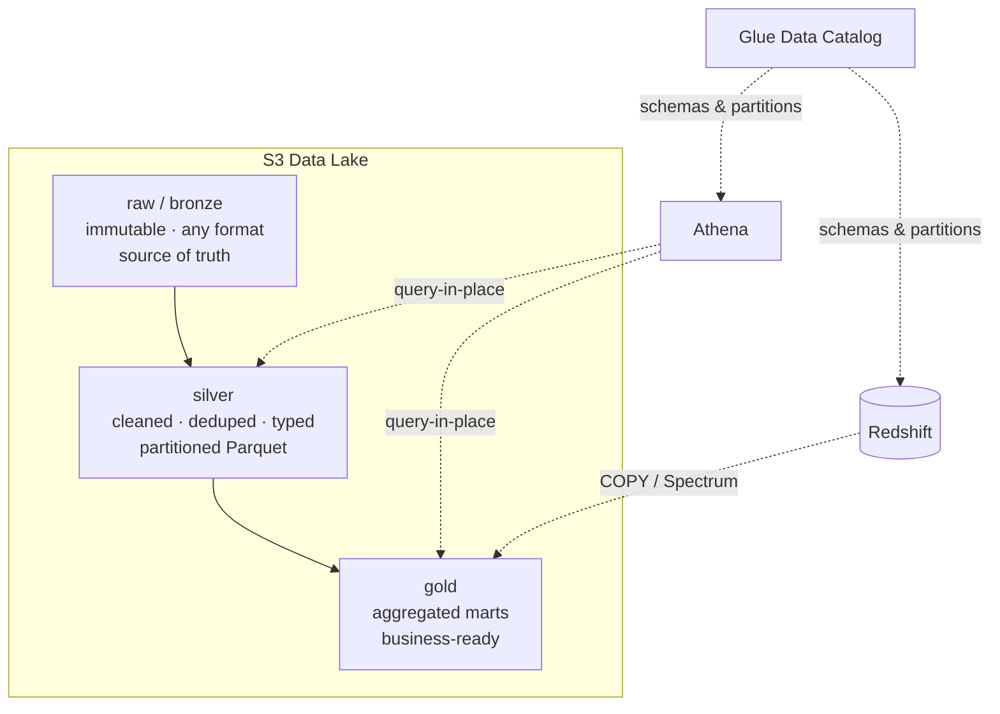
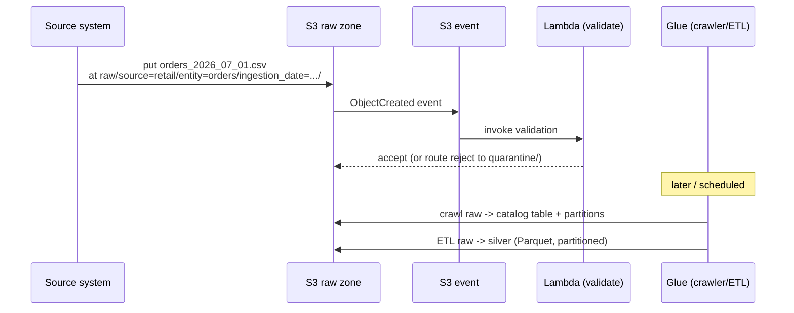
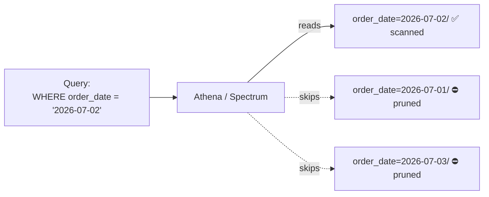
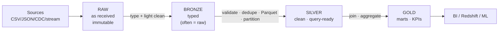

# 02 · Architecture

The diagrams the spec calls for: the zone model, the ingestion flow, partition pruning, and the raw→bronze→silver→gold progression.

## S3 data lake zone diagram

Each zone is optimized for its job: raw for fidelity and replay, silver for query performance, gold for serving.

## File ingestion flow

The event-driven validation piece (Lambda) is built in Module 03; here it shows how a file's arrival kicks off the pipeline.

## Partition pruning explanation

Only the matching partition folder is read; the rest are skipped. Fewer bytes scanned = lower cost and faster results. This is why partitioning on the column you filter by is the highest-impact layout decision.

## Raw → bronze → silver → gold flow

Data gets more refined and more valuable left-to-right; it also gets smaller and more query-optimized. The transformations between zones are Glue/Spark jobs (Module 04); this module is about the *storage* those jobs read from and write to.

## Where this sits in the platform

This storage layer is the backbone of the [capstone platform](../projects/project-07-enterprise-data-platform/). Every ingestion source lands in raw; every processing job reads one zone and writes the next; every query engine reads silver or gold. Get these four diagrams into your head and the rest of the platform is "what fills the arrows."
