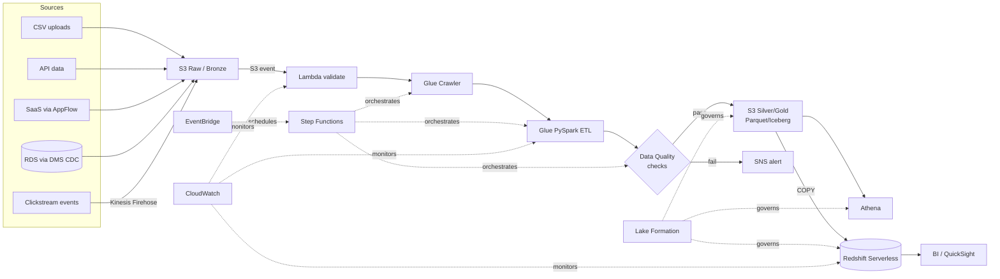

# AWS Data Engineering — Beginner to Architect

A practical, build-as-you-learn reference for AWS data engineering. It takes you from "what is a data lake" to designing and deploying a production, multi-source data platform — and prepares you for the **AWS Certified Data Engineer – Associate (DEA-C01)** along the way.

This repo is opinionated about one thing: **you learn data engineering by building pipelines, breaking them, and fixing them — not by reading.** So every concept is paired with runnable code, a hands-on lab with cleanup, and the architect-level *why* behind each choice.

---

## Who this repo is for

- **Beginners** who know some Python/SQL and want a structured path into AWS data engineering.
- **Practitioners** who can write a Glue job but want production discipline: monitoring, idempotency, CI/CD, cost control.
- **Senior engineers & aspiring architects** who need the decision frameworks and trade-off reasoning for designing platforms, not just pipelines.
- **Cert candidates** preparing for DEA-C01 who want competence, not a brain-dump.

You don't have to pick a lane. Every module is layered: a beginner explanation, a practitioner build, and an architect's trade-off discussion.

---

## The learning approach

Every topic is taught the same way, first-principles and Feynman-style — explain it plainly, then go deep. Each service answers a fixed set of questions: what it is, why it exists, what real problem it solves, how it works internally, when to use it, when *not* to, how to implement and deploy it, how to monitor it, what fails in production, and what an architect weighs. If a page doesn't help you build or decide something, it doesn't belong here.

---

## High-level architecture

The whole repo builds toward this: the **Enterprise Retail Sales Data Platform**, a production-style pipeline ingesting five source types into a governed lakehouse and warehouse.

Full architecture, every CDK stack, and the deployment walkthrough live in [`projects/project-07-enterprise-data-platform/`](./projects/project-07-enterprise-data-platform/).

---

## Module map

| # | Module | Level | What you learn |
|---|--------|-------|----------------|
| 00 | [Foundations](./00-foundations/) | Beginner | The lifecycle, the service landscape, lake vs warehouse vs lakehouse |
| 01 | [AWS Core Services](./01-aws-core-services/) | Beginner | IAM, VPC, KMS, CloudWatch, CloudTrail, Secrets Manager, SSM |
| 02 | [Storage & S3 Lake](./02-storage-s3-lake/) | Beginner→Int | S3, lifecycle, partitioning, bronze/silver/gold, Glue Catalog, Iceberg |
| 03 | [Ingestion](./03-ingestion/) | Intermediate | DMS, DataSync, Transfer Family, AppFlow, API GW, Firehose |
| 04 | [Batch Processing](./04-batch-processing/) | Intermediate | Glue ETL, crawlers, bookmarks, data quality, EMR, EMR Serverless |
| 05 | [Streaming](./05-streaming/) | Advanced | Kinesis, MSK, Managed Flink, exactly-once, late data, replay |
| 06 | [Orchestration](./06-orchestration/) | Intermediate | Step Functions, MWAA, Glue Workflows, EventBridge |
| 07 | [Redshift Warehouse](./07-data-warehouse-redshift/) | Advanced | Modeling, dist/sort keys, Spectrum, COPY, materialized views |
| 08 | [Governance & Security](./08-governance-security/) | Advanced | Lake Formation, KMS, column/row security, PII, CloudTrail |
| 09 | [Architecture Patterns](./09-architecture-patterns/) | Architect | Lambda vs Kappa, medallion lakehouse, reference architectures |
| 10 | [Certification Prep](./10-cert-prep/) | All | DEA-C01 domain mapping, scenario practice, exam strategy |
| 11 | [Production Engineering](./11-production-engineering/) | Senior | CI/CD, OIDC, testing, idempotency, reconciliation, SLAs |
| 12 | [Senior Architect Playbook](./12-senior-architect-playbook/) | Architect | Multi-account, environments, governance, enterprise platform design |

---

## Hands-on project map

| Project | Builds | Key services |
|---|---|---|
| [01 File Ingestion](./projects/project-01-file-ingestion-pipeline/) | S3 drop → validate → catalog → query | S3, Lambda, Glue, Athena |
| [02 API to S3](./projects/project-02-api-to-s3-pipeline/) | Scheduled API pull → lake | Lambda, EventBridge, S3 |
| [03 CDC with DMS](./projects/project-03-cdc-dms-pipeline/) | RDS change capture → lake | DMS, S3, Glue |
| [04 Streaming](./projects/project-04-streaming-kinesis-pipeline/) | Clickstream → S3/Redshift | Kinesis, Firehose, Flink |
| [05 Redshift Warehouse](./projects/project-05-redshift-warehouse-pipeline/) | Dimensional marts | Redshift, Glue, S3 |
| [06 Governed Lakehouse](./projects/project-06-governed-lakehouse/) | Iceberg + fine-grained access | Iceberg, Lake Formation, Athena |
| [07 Enterprise Platform](./projects/project-07-enterprise-data-platform/) | **The capstone** — all of the above | Everything |

---

## Lab map

Thirteen self-contained labs, each with objective, architecture, prerequisites, **cost warning**, steps, code, validation, **cleanup**, interview questions, and production notes. See [`labs/`](./labs/).

**Status:** [Lab 01 — S3 Data Lake](./labs/lab-01-s3-data-lake/) is complete and fully runnable (deployable CDK stack, working scripts, passing tests, cleanup). Lab 02 (Glue crawler) is written and synth-verified but awaiting an end-to-end run against a real account. Labs 03–13 are scaffolds and **not runnable yet** — see [`REPO-CONTENT-GAP-REPORT.md`](./REPO-CONTENT-GAP-REPORT.md) for exactly what's done vs pending.

> 💰 **Cost warning:** labs create real, billable AWS resources. Every lab has a mandatory cleanup step. Always set a budget alarm first — see [`labs/lab-01-s3-data-lake/`](./labs/) and the account-setup guidance in [Module 01](./01-aws-core-services/).

---

## Certification map

This repo aligns to the four DEA-C01 domains. Full mapping — which modules and labs teach each domain, plus original scenario questions — is in [`CERTIFICATION-MAPPING.md`](./CERTIFICATION-MAPPING.md).

| Domain | Weight | Where it's taught |
|---|---|---|
| 1 · Data Ingestion & Transformation | ~34% | Mods 03, 04, 05, 06 |
| 2 · Data Store Management | ~26% | Mods 02, 07 |
| 3 · Data Operations & Support | ~22% | Mods 06, 11 |
| 4 · Data Security & Governance | ~18% | Mods 01, 08 |

---

## Prerequisites

- Python 3.11+ and basic SQL.
- An AWS account you control (a personal sandbox, **not** a shared work account).
- AWS CLI v2 configured, and Node.js (for the AWS CDK).
- A budget alarm set before you run anything billable.

---

## How to run a lab

1. Read the lab's `README.md` fully, including the cost warning.
2. Set/confirm a budget alarm.
3. Follow the steps (CLI commands and/or CDK deploy).
4. Run the validation step to confirm it works.
5. **Run the cleanup step.** Non-negotiable.

## How to deploy the end-to-end project

The capstone deploys via AWS CDK (Python). High level: configure `infra/cdk/`, bootstrap your account, then `cdk deploy` the stacks in dependency order. Full instructions in the capstone project README. CI/CD via GitHub Actions + OIDC is documented in [Module 11](./11-production-engineering/).

---

## Roadmap, contribution, and the rest

- [`ROADMAP.md`](./ROADMAP.md) — the beginner→architect progression.
- [`LEARNING-PATH.md`](./LEARNING-PATH.md) — a concrete week-by-week order.
- [`SERVICE-DECISION-FRAMEWORK.md`](./SERVICE-DECISION-FRAMEWORK.md) — the comparison tables (Glue vs EMR vs Lambda, etc.).
- [`COST-OPTIMIZATION.md`](./COST-OPTIMIZATION.md), [`SECURITY-GOVERNANCE.md`](./SECURITY-GOVERNANCE.md), [`TROUBLESHOOTING-RUNBOOK.md`](./TROUBLESHOOTING-RUNBOOK.md) — the operational backbone.
- [`INDUSTRY-USE-CASES.md`](./INDUSTRY-USE-CASES.md) — patterns by industry.
- [`LATEST-AWS-UPDATES.md`](./LATEST-AWS-UPDATES.md) — and how to keep it current.
- [`CONTRIBUTING.md`](./CONTRIBUTING.md) — conventions.

---

## Content status (honest, updated per pass)

Built in deep, complete passes. **[`REPO-CONTENT-GAP-REPORT.md`](./REPO-CONTENT-GAP-REPORT.md)** is the audited inventory; this is the summary:

| Status | What |
|---|---|
| ✅ **Complete** | Root reference docs · **Module 01 (AWS core services — IAM/STS, VPC, KMS/Secrets/SSM, CloudWatch/CloudTrail, SQS/SNS, EventBridge, Lambda, Step Functions)** · **Module 02 (S3 data lake)** · **Lab 01** (runnable end-to-end) · scripts, sample data, 47 passing tests |
| ✅ **Deployable CDK** | `DataLakeStack` and `GlueCatalogStack` (both `cdk synth`-verified; DataLakeStack is Lab 01's) |
| 🔄 **In progress** | Lab 02 (code-complete with tests, commands, and cleanup; **synth-verified only** — one live-account verification run pending, checklist in the lab README) |
| 📋 **Planned / scaffolded** | Module 00's topical files; Modules 03–12; Labs 03–13; Projects 01–07 (skeleton READMEs) — every scaffold self-identifies and is tracked in the gap report |

**Not runnable yet:** Labs 03–13 and all projects. Nothing in this repo claims to run unless it has code, commands, validation, tests, and cleanup. Standards: [`CLAUDE.md`](./CLAUDE.md) · [`CONTENT-STANDARD.md`](./CONTENT-STANDARD.md) · build order: [`REPO-BUILD-ROADMAP.md`](./REPO-BUILD-ROADMAP.md).

---

## Disclaimer

AWS changes constantly — service limits, pricing, and features in this repo can go stale. **Always verify against official AWS docs, the AWS Big Data Blog, and AWS What's New.** This repo teaches durable concepts and decision-making; it is not a substitute for current AWS documentation.

This is original writing. It's informed by the standard canon of the field and the official DEA-C01 exam guide, but it does not reproduce copyrighted book content. Where a concept maps to AWS's own docs, the docs are linked rather than copied.
