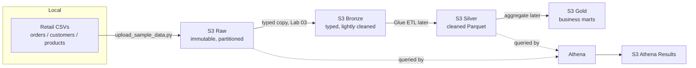

# Lab 01 — Build an S3 Data Lake with Bronze, Silver, and Gold Zones

A complete, runnable lab. You'll stand up a real S3 data lake with the medallion (raw/bronze → silver → gold) zone design, upload partitioned retail data, validate the layout, and tear it all down. Everything here runs; every AWS command has a matching cleanup.

---

## 1. Objective

Learn *why* a data lake is layered into zones and *how* the physical S3 layout (Hive-style partitions) makes data cheap and fast to query later. By the end you can explain the raw/silver/gold split, deploy production-safe buckets with CDK, and lay data out so Athena can prune partitions.

## 2. What you'll build

- Five S3 buckets — **raw**, **bronze**, **silver**, **gold**, and an **Athena query-results** bucket — each with encryption, versioning, blocked public access, lifecycle tiering, and tags. In this lab you land data in **raw**; bronze holds the typed/lightly-cleaned copy that later labs (Glue ETL) produce.
- Retail sample data (orders, customers, products) landed in the raw zone under a partitioned key design.
- Scripts to create the layout, upload data, and validate it.

## 3. Real industry use case

A retailer receives daily `orders`, `customers`, and `products` extracts from multiple systems. Landing them raw and immutable (bronze), then cleaning to silver and aggregating to gold, is exactly how retail/e-commerce analytics platforms are built — it keeps a replayable source of truth while serving fast marts to BI. This lab is the storage foundation of the repo's [capstone platform](../../projects/project-07-enterprise-data-platform/).

## 4. Architecture



The silver/gold *transformation* is built in later labs (Glue ETL). This lab establishes the zones and the raw landing layout that everything downstream depends on.

## 5. AWS services used

Amazon S3 (five buckets), AWS CDK (provisioning), and AWS CLI. Athena is referenced conceptually here and used for real in Lab 04.

## 6. Prerequisites

- An AWS account **you control** (personal sandbox, not shared/work).
- AWS CLI v2 configured: `aws configure` then `aws sts get-caller-identity` should return your identity.
- Node.js + `npm install -g aws-cdk`.
- Python 3.11+, and from the repo root: `pip install -r infra/cdk/requirements.txt boto3`.
- **A budget alarm set** (see [account setup](../00-account-setup/)).

## 7. 💰 Cost warning

This lab creates **real S3 buckets and objects**. With the tiny sample data, cost is a few cents at most. But S3 charges for storage and requests, and **versioned buckets keep old object versions**, so you must run the cleanup (Section 16) to stop all charges. Never leave lab resources running.

## 8. Folder / bucket design

Five buckets, each named `ade-retail-lake-<zone>-<account>-<region>` (the account+region suffix keeps names globally unique — set by CDK at deploy time, no account ID hardcoded):

| Bucket | Purpose | Versioned | Lifecycle |
|---|---|---|---|
| `...-raw-...` | Immutable landing zone, exactly as received | Yes | → IA @30d, → Glacier @90d |
| `...-bronze-...` | Typed / lightly-cleaned copy of raw (filled by Lab 03) | Yes | non-current cleanup @60d |
| `...-silver-...` | Cleaned, query-ready | Yes | non-current cleanup @30d |
| `...-gold-...` | Business marts | Yes | non-current cleanup @30d |
| `...-athena-results-...` | Query output | No | expire @14d |

## 9. Local setup

From the repo root:

```bash
# (optional) mirror the zone layout locally to inspect it, no AWS needed
python scripts/create_local_lake_layout.py --base ./local-lake

# install deps
pip install -r infra/cdk/requirements.txt boto3
```

## 10. AWS CLI commands (identity + manual inspection)

```bash
aws sts get-caller-identity          # confirm who you are / correct account
aws configure get region             # confirm your region
# after deploy, list your lake buckets:
aws s3 ls | grep ade-retail-lake
```

## 11. CDK deployment

```bash
cd infra/cdk
cdk bootstrap                        # one-time per account/region
cdk synth                            # render CloudFormation locally — no cost
cdk deploy DataLakeStack             # creates the 5 buckets — see cost note
```

`cdk deploy` prints the bucket names as stack **Outputs** (RawBucketName, etc.). Copy the raw bucket name for the next step, or fetch it:

```bash
RAW_BUCKET=$(aws cloudformation describe-stacks --stack-name DataLakeStack \
  --query "Stacks[0].Outputs[?OutputKey=='RawBucketName'].OutputValue" --output text)
echo "$RAW_BUCKET"
```

## 12. Sample data upload

```bash
# from repo root — dry run first to see exactly what lands where:
python scripts/upload_sample_data.py --bucket "$RAW_BUCKET" --ingestion-date 2026-07-01 --dry-run

# real upload:
python scripts/upload_sample_data.py --bucket "$RAW_BUCKET" --ingestion-date 2026-07-01
```

This lands each entity at:
```
raw/source=retail/entity=orders/ingestion_date=2026-07-01/orders_2026_07_01.csv
raw/source=retail/entity=customers/ingestion_date=2026-07-01/customers_2026_07_01.csv
raw/source=retail/entity=products/ingestion_date=2026-07-01/products_2026_07_01.csv
```

## 13. Partitioning explanation

The key design is **Hive-style `key=value` partitioning**:

```
raw/source=retail/entity=orders/ingestion_date=2026-07-01/orders_2026_07_01.csv
    partition columns a crawler / Athena auto-detect: source, entity, ingestion_date
```

Why this matters:
- **Partition pruning:** a query like `WHERE ingestion_date = '2026-07-01'` reads only that day's folder instead of scanning the whole dataset. Athena bills per byte scanned, so this is a direct cost lever.
- **Auto-discovery:** Glue crawlers and Athena recognize `key=value` folders and expose `source`, `entity`, and `ingestion_date` as columns with no extra config.
- **Multi-tenancy by design:** `source=` and `entity=` let one bucket cleanly hold many sources/tables without collisions.

Pick partition keys you actually filter on (dates are the classic choice). Over-partitioning on a high-cardinality key creates millions of tiny files — see Common Mistakes.

## 14. Validation

```bash
python scripts/validate_s3_layout.py --bucket "$RAW_BUCKET" --ingestion-date 2026-07-01
```

Expected output — `PASS` for all three entities and exit code 0:
```
[PASS] orders    s3://.../raw/source=retail/entity=orders/ingestion_date=2026-07-01/orders_2026_07_01.csv
[PASS] customers s3://.../.../customers_2026_07_01.csv
[PASS] products  s3://.../.../products_2026_07_01.csv
All 3 expected objects present for 2026-07-01.
```

You can also confirm the offline logic and data quality without AWS:
```bash
pytest tests/unit/test_s3_key_layout.py tests/unit/test_sample_data_schema.py -q
```

## 15. Athena-ready layout explanation

Because the data sits under `key=value` partitions in a single logical prefix, a Glue crawler pointed at `s3://<raw>/raw/` will create a table with `source`, `entity`, and `ingestion_date` as partition columns. Athena can then run `SELECT ... WHERE ingestion_date = '2026-07-01'` and scan only that partition. Converting the raw CSV to partitioned **Parquet** in the silver zone (Lab 03) cuts scan cost further, since Athena reads only the needed columns. This lab deliberately stops at raw CSV so you can *see* the before state; Labs 02–04 crawl, transform, and query it.

## 16. Cleanup (mandatory)

```bash
# 1. Empty the versioned buckets (CDK auto_delete_objects handles this on destroy,
#    but if you uploaded a lot, you can also empty manually):
aws s3 rm "s3://$RAW_BUCKET" --recursive

# 2. Destroy the stack — removes all five buckets:
cd infra/cdk
cdk destroy DataLakeStack
```

Confirm nothing remains:
```bash
aws s3 ls | grep ade-retail-lake   # should return nothing
```

> The stack uses `removal_policy=DESTROY` + `auto_delete_objects=True` **for this lab only**. In production you'd use `RETAIN` to prevent accidental data loss.

## 17. Common mistakes

- **Partitioning on a high-cardinality key** (e.g. `order_id`) → millions of tiny folders/files, killing performance (the "small files problem"). Partition on dates/low-cardinality keys.
- **Editing data in the raw zone.** Raw is immutable — treat it as the append-only source of truth; do cleaning in silver.
- **Forgetting cleanup**, then being surprised by storage charges on versioned buckets.
- **Making a bucket public** to "make it easier." Never; the stack blocks all public access on purpose.
- **Hardcoding bucket names** without a unique suffix → global name collisions.

## 18. Troubleshooting

| Symptom | Likely cause | Fix |
|---|---|---|
| `cdk deploy` → "bucket already exists" | Name collision (rare, with suffix) | Change `lake_prefix`, or a leftover bucket exists — check `aws s3 ls`. |
| Upload → `NoCredentialsError` | CLI not configured | `aws configure`, or pass `--profile`. |
| Upload → `AccessDenied` | Identity lacks `s3:PutObject` | Use an admin/appropriately-scoped identity in your sandbox. |
| Validate → `FAIL` | Uploaded a different date | Match `--ingestion-date` between upload and validate. |
| `cdk destroy` leaves a bucket | Bucket not empty (older versions) | `aws s3 rm s3://<bucket> --recursive`, retry destroy. |

See the repo-wide [TROUBLESHOOTING-RUNBOOK](../../TROUBLESHOOTING-RUNBOOK.md) for more.

## 19. Interview questions

1. Why layer a lake into raw/silver/gold instead of one bucket? (Replayable source of truth; separation of concerns; cost/format optimization per zone.)
2. What does Hive-style `key=value` partitioning buy you? (Auto-discovery + partition pruning → cheaper, faster queries.)
3. What's the "small files problem" and how do you avoid it? (Too many tiny objects from over-partitioning; partition on low-cardinality keys, compact files.)
4. Why version the raw bucket? (Recover from bad writes/overwrites; supports immutability of the source of truth.)
5. Why is S3 the foundation of AWS lakes rather than a database? (Cheap, durable, decoupled storage; bring compute to it on demand.)

## 20. Production notes

- **Idempotency:** re-running the upload for the same date overwrites the same keys (deterministic layout) rather than duplicating — safe to retry.
- **Naming & environments:** in production you'd suffix or separate by environment (`dev`/`uat`/`prod`) and often use separate accounts.
- **Encryption:** this lab uses SSE-S3; regulated workloads use SSE-KMS with customer-managed keys for auditability (Module 08).
- **Lifecycle:** tune tiering to your access patterns; raw data rarely re-read is the prime candidate for IA/Glacier.
- **Access:** this lab uses coarse IAM; fine-grained column/row access comes with Lake Formation (Module 08).

## 21. Architect-level trade-offs

- **Bronze == raw, or distinct?** In simple lakes bronze *is* raw. Splitting them (raw = exactly-as-received bytes; bronze = typed/lightly-cleaned) adds a layer but buys a cleaner replay boundary. Choose based on how messy your sources are.
- **Partition granularity:** daily partitions suit most retail batch loads. Hourly helps high-volume streaming but multiplies file count — balance query latency against the small-files cost.
- **One bucket vs many:** `source=`/`entity=` prefixes let one bucket hold many datasets (simpler IAM surface), but separate buckets give clearer blast-radius isolation and per-dataset lifecycle/keys. Most teams start with prefixes and split out the sensitive datasets.
- **Format now vs later:** landing raw as CSV keeps ingestion simple and preserves the source; converting to Parquet/Iceberg in silver is where you pay once to save on every downstream query.

---

### Related
- Module: [02 · Storage & S3 Lake](../../02-storage-s3-lake/) — the concepts behind this lab.
- Stack: [`infra/cdk/stacks/s3_data_lake_stack.py`](../../infra/cdk/stacks/s3_data_lake_stack.py)
- Scripts: [`scripts/`](../../scripts/) · Data: [`data/sample/retail/`](../../data/sample/retail/) · Tests: [`tests/unit/`](../../tests/unit/)
