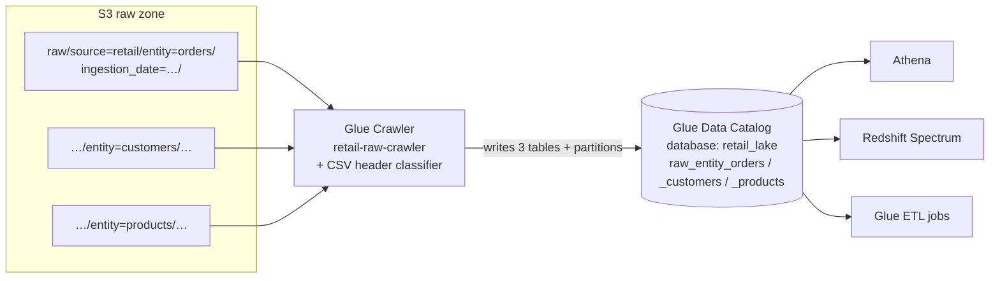

# Lab 02 — Catalog the Data Lake with a Glue Crawler

> **Verification status: synth-verified only.** Everything below is real code with real commands: the stack synthesizes cleanly, 15 automated tests cover the template and the validation logic, and the command sequence is complete from deploy to cleanup. It has **not yet been executed against a live AWS account from this repo** — the exact manual verification checklist is in [Section 12](#12-manual-end-to-end-verification-checklist). When someone completes that checklist, this banner comes down (tracked in [REPO-CONTENT-GAP-REPORT](../../REPO-CONTENT-GAP-REPORT.md)).

You'll point an AWS Glue crawler at the raw zone from Lab 01, have it auto-discover schemas and partitions, and end up with **one queryable table per entity** in the Glue Data Catalog. This is the metadata layer every query engine (Athena, Redshift Spectrum, EMR, Glue jobs) reads.

**Prerequisite:** [Lab 01](../lab-01-s3-data-lake/) deployed, with sample data uploaded.

---

## 1. Objective

Understand what the Glue Data Catalog is, why a crawler exists, how Hive-style partitions become queryable columns — and why crawler *scoping* (what path you point it at) decides whether you get clean tables or a mess.

## 2. Business scenario

The retailer's raw zone receives daily orders/customers/products files. Before anyone can run SQL over them, the platform needs a **catalog**: table definitions (schema + partitions + location) that all query engines share. A crawler keeps that catalog in sync as new daily partitions land, so analysts never hand-write schemas.

## 3. Architecture



**Design decision worth understanding:** the crawler has **three targets, one per entity** — not one target at `raw/`. The three entities have *different schemas*; a single target would ask the crawler to fold incompatible schemas into one table (the exact anti-pattern the [runbook](../../TROUBLESHOOTING-RUNBOOK.md#glue-crawler-does-not-detect-the-table) warns about). Entity-level targets give one correctly-typed table per entity, each partitioned by `ingestion_date` — the only `key=value` level below each target path. The `source=`/`entity=` levels still do their job: they *organize* the bucket and *scope* the targets.

## 4. AWS services used

AWS Glue (Data Catalog, Crawler, CSV Classifier), IAM (least-privilege crawler role), S3 (source), AWS CDK (provisioning), Athena (a one-query sanity check; full Athena is Lab 04).

## 5. Prerequisites

- Lab 01 complete: `DataLakeStack` deployed, sample data uploaded.
- AWS CLI v2 configured (`aws sts get-caller-identity` works); Node.js; `pip install -r infra/cdk/requirements.txt boto3`.

## 6. 💰 Estimated cost & safety warning

A crawler run bills per DPU-hour with a 10-minute minimum billing granularity — for this dataset a run finishes in ~1–2 minutes and costs **a few cents**. Database/table definitions are free. The one-query Athena check scans a few KB (fractions of a cent). **Run the cleanup (Section 13).** Never leave a crawler on a schedule you've forgotten.

## 7. Deployment (exact commands)

```bash
# 0. From the repo root, with Lab 01 already deployed:
RAW_BUCKET=$(aws cloudformation describe-stacks --stack-name DataLakeStack \
  --query "Stacks[0].Outputs[?OutputKey=='RawBucketName'].OutputValue" --output text)
echo "raw bucket: $RAW_BUCKET"

# 1. Make sure data is present for the date you'll crawl:
python scripts/upload_sample_data.py --bucket "$RAW_BUCKET" --ingestion-date 2026-07-01
python scripts/validate_s3_layout.py  --bucket "$RAW_BUCKET" --ingestion-date 2026-07-01

# 2. Deploy the catalog stack, wired to Lab 01's output:
cd infra/cdk
cdk synth  GlueCatalogStack -c raw_bucket_name="$RAW_BUCKET"   # render first — free
cdk deploy GlueCatalogStack -c raw_bucket_name="$RAW_BUCKET"
cd ../..
```

The stack ([`glue_catalog_stack.py`](../../infra/cdk/stacks/glue_catalog_stack.py)) outputs `GlueDatabaseName=retail_lake` and `CrawlerName=retail-raw-crawler`.

## 8. Code explanation

What the stack creates, and why each piece exists:

- **`CfnDatabase` `retail_lake`** — the logical container for tables.
- **Crawler role** — the managed `AWSGlueServiceRole` (catalog writes + logs) plus an inline statement allowing `s3:GetObject`/`s3:ListBucket` on *only* the raw bucket and its `raw/*` prefix. The crawler cannot read silver/gold or any other bucket. The stack also rejects malformed bucket names at synth time.
- **CSV classifier with `ContainsHeader=PRESENT`** — Glue's built-in CSV classifier *guesses* whether row 1 is a header, and guesses wrong when every column is a string (true for `customers.csv`), producing `col0, col1, …` column names. Declaring the header removes the guess. This is a classic real-world crawler bug, pre-empted in code.
- **`CfnCrawler`** — three entity-level S3 targets, `TablePrefix=raw_`, `UPDATE_IN_DATABASE` schema policy (re-crawls update in place instead of duplicating), `DeleteBehavior=LOG` (a vanished file logs a warning rather than silently dropping a table), `RecrawlPolicy=CRAWL_EVERYTHING` (fine at this size; large production prefixes use `CRAWL_NEW_FOLDERS_ONLY`).

## 9. Trigger — run the crawler (exact commands)

```bash
aws glue start-crawler --name retail-raw-crawler

# Poll until READY (typically 1–2 minutes for this dataset):
while [ "$(aws glue get-crawler --name retail-raw-crawler \
          --query 'Crawler.State' --output text)" != "READY" ]; do
  echo "crawler still running..."; sleep 15
done
aws glue get-crawler --name retail-raw-crawler \
  --query "Crawler.LastCrawl.{Status:Status,Error:ErrorMessage}" --output table
```

`LastCrawl.Status` must be `SUCCEEDED`.

## 10. Validation (exact commands)

**Option A — the repo's validation script (recommended; it's the same check a pipeline would run):**

```bash
# waits for the crawler, then checks database, 3 tables, schemas, partition keys,
# and that the 2026-07-01 partition is registered; exits non-zero on any failure
python scripts/validate_glue_catalog.py --wait --ingestion-date 2026-07-01
```

**Option B — raw AWS CLI checks (know these for debugging and interviews):**

```bash
# 1. Tables created (expect three, one per entity, prefixed raw_):
aws glue get-tables --database-name retail_lake \
  --query "TableList[].Name" --output table

# 2. Partition key on the orders table (expect exactly: ingestion_date):
ORDERS_TABLE=$(aws glue get-tables --database-name retail_lake \
  --query "TableList[?contains(Name,'orders')].Name | [0]" --output text)
aws glue get-table --database-name retail_lake --name "$ORDERS_TABLE" \
  --query "Table.PartitionKeys[].Name" --output text

# 3. Columns the crawler inferred (expect the CSV headers, not col0/col1):
aws glue get-table --database-name retail_lake --name "$ORDERS_TABLE" \
  --query "Table.StorageDescriptor.Columns[].Name" --output text

# 4. The partition is registered for the crawled date:
aws glue get-partitions --database-name retail_lake --table-name "$ORDERS_TABLE" \
  --expression "ingestion_date = '2026-07-01'" \
  --query "Partitions[].Values" --output text
```

**Option C — one-query Athena sanity check via CLI** (uses Lab 01's results bucket):

```bash
RESULTS_BUCKET=$(aws cloudformation describe-stacks --stack-name DataLakeStack \
  --query "Stacks[0].Outputs[?OutputKey=='AthenaResultsBucketName'].OutputValue" --output text)

QID=$(aws athena start-query-execution \
  --query-string "SELECT order_id, status, ingestion_date FROM \"retail_lake\".\"$ORDERS_TABLE\" LIMIT 5" \
  --result-configuration OutputLocation="s3://$RESULTS_BUCKET/lab02/" \
  --query QueryExecutionId --output text)

sleep 5   # tiny query; poll get-query-execution for bigger ones
aws athena get-query-results --query-execution-id "$QID" \
  --query "ResultSet.Rows[].Data[].VarCharValue" --output table
```

## 11. Expected output

- `LastCrawl.Status` = `SUCCEEDED`.
- **Three tables** in `retail_lake` with prefix `raw_`, one per entity (names like `raw_entity_orders` — derived from the target folder; the validation script matches by entity substring so exact sanitization doesn't matter).
- Each table's `PartitionKeys` = `ingestion_date` — proving the crawler auto-detected the Hive-style partition below each entity path.
- Each table's columns match the CSV headers (`order_id … status`, `customer_id … customer_segment`, `product_id … currency`) — proving the header classifier worked.
- `validate_glue_catalog.py` prints `[PASS]` ×7 and exits 0.
- The Athena query returns 5 order rows.

## 12. Manual end-to-end verification checklist

What "verified" means for this lab. Run on a real sandbox account, in order; every command is above.

1. ☐ Lab 01 deployed + data uploaded for `2026-07-01` (Section 7, steps 0–1).
2. ☐ `cdk deploy GlueCatalogStack -c raw_bucket_name=$RAW_BUCKET` succeeds (Section 7, step 2).
3. ☐ Crawler run reaches `READY` with `LastCrawl.Status=SUCCEEDED` (Section 9).
4. ☐ `python scripts/validate_glue_catalog.py --wait --ingestion-date 2026-07-01` exits 0 (Section 10A).
5. ☐ Athena returns rows (Section 10C).
6. ☐ Re-run the crawler after uploading a second date (`--ingestion-date 2026-07-02`), re-validate with the new date: the new partition appears, **no duplicate tables** (proves `UPDATE_IN_DATABASE`).
7. ☐ Cleanup completes and the post-cleanup checks pass (Section 13).
8. ☐ Update this README (remove the banner) and [REPO-CONTENT-GAP-REPORT](../../REPO-CONTENT-GAP-REPORT.md).

If any step fails, that's a finding — fix the code/doc here, don't work around it silently.

## 13. Cleanup (mandatory)

```bash
# Crawler must not be mid-run when the stack deletes it:
aws glue get-crawler --name retail-raw-crawler --query "Crawler.State" --output text  # READY

cd infra/cdk
cdk destroy GlueCatalogStack -c raw_bucket_name="$RAW_BUCKET"
cd ../..

# Confirm the database (and its tables, deleted by cascade) is gone:
aws glue get-database --name retail_lake 2>&1 | grep -q EntityNotFound && echo "catalog cleaned"
aws glue get-crawler  --name retail-raw-crawler 2>&1 | grep -q EntityNotFound && echo "crawler cleaned"

# Athena query results from Section 10C live under s3://$RESULTS_BUCKET/lab02/ —
# they expire via lifecycle in 14 days, or remove now:
aws s3 rm "s3://$RESULTS_BUCKET/lab02/" --recursive
```

Keep `DataLakeStack` if you're continuing to Lab 03/04; otherwise run Lab 01's cleanup too.

## 14. Troubleshooting

| Symptom | Likely cause | Check | Fix |
|---|---|---|---|
| **Crawler creates no tables** | Empty/missing data under the target paths, or crawler ran before upload | `aws s3 ls s3://$RAW_BUCKET/raw/source=retail/ --recursive` | Upload data (Section 7 step 1), re-run the crawler |
| **Crawler doesn't detect the schema / columns are `col0,col1,…`** | CSV header guessed as data (all-string file) or unsupported format | `get-table ... Columns[].Name`; crawler CloudWatch log `/aws-glue/crawlers` | The stack's CSV classifier fixes this — confirm the crawler shows `Classifiers: [retail-raw-csv-header]` (`aws glue get-crawler`); re-deploy if you modified it away |
| **Wrong S3 path crawled** | Stack deployed with a wrong/stale `raw_bucket_name` context | `aws glue get-crawler --name retail-raw-crawler --query "Crawler.Targets.S3Targets[].Path"` | Redeploy with the correct `-c raw_bucket_name="$RAW_BUCKET"` (the value from the DataLakeStack output, not a hand-typed name) |
| **IAM AccessDenied during crawl** | Crawler role can't read the bucket (or its KMS key, if you added one) | Crawler log shows the denied action; role policy in IAM console | The stack scopes `s3:GetObject/ListBucket` to the raw bucket — if you renamed buckets, redeploy; if you added SSE-KMS, grant the role `kms:Decrypt` |
| **Partition issues: new date not in the catalog** | Crawler hasn't re-run since the upload | `get-partitions --expression "ingestion_date='<date>'"` | Re-run the crawler; production alternatives: post-load `ALTER TABLE ADD PARTITION`, or partition projection (Lab 04) |
| **Catalog table missing after it existed** | Database/table deleted, or crawler re-created names differently after a config change | `aws glue get-tables --database-name retail_lake` | Re-run the crawler; if you changed `TablePrefix`/targets, old-named tables linger — delete them (`aws glue delete-table`) and re-crawl |
| **Two tables for one entity** | Target/prefix config changed between runs | `get-tables` names | Delete stale tables, keep config stable; this is why table naming belongs in code review |
| **Athena: `TABLE_NOT_FOUND`** | Wrong database or table name in the query | `SHOW TABLES IN retail_lake` (Athena) | Query `"retail_lake"."<exact table name>"` from the `get-tables` output |

Runbook versions with prevention + senior notes: [TROUBLESHOOTING-RUNBOOK → S3 data lake runbooks](../../TROUBLESHOOTING-RUNBOOK.md#glue-crawler-does-not-detect-the-table).

## 15. Tests

Automated, run locally, no AWS needed:

```bash
# Template assertions: entity-level targets wired to the raw bucket, scoped IAM,
# classifier attached, schema policy, outputs (7 tests):
.venv/bin/python -m pytest tests/infra/test_glue_catalog_stack.py -q

# Validation-logic tests against a fake Glue client (8 tests):
.venv/bin/python -m pytest tests/unit/test_validate_glue_catalog.py -q
```

The template tests are the contract between this lab and the stack: if someone re-points the crawler at `raw/` root or broadens the IAM role, a test fails before anything deploys.

## 16. Interview questions

1. What is the Glue Data Catalog and who reads it? *(Central metadata — schema/location/partitions — shared by Athena, Redshift Spectrum, EMR, Glue jobs.)*
2. What does a crawler actually do? *(Scans the target paths, classifies formats, infers schemas, writes/updates table + partition definitions.)*
3. Why one crawler target per entity here, instead of one at `raw/`? *(Entities have different schemas; one target would merge incompatible schemas into one table or fragment unpredictably. Target scoping is schema scoping.)*
4. Why did `ingestion_date` become a column? *(Hive-style `key=value` folders below the target are auto-detected as partition columns.)*
5. When would you *not* use a crawler? *(Stable, known schemas → define tables in IaC/DDL; high-partition tables → partition projection; Iceberg tables → the table format owns its own metadata.)*
6. What does `UPDATE_IN_DATABASE` + `DeleteBehavior=LOG` mean operationally? *(Re-crawls update schemas/partitions in place; disappeared data logs instead of silently dropping tables — schema changes stay visible events.)*
7. A crawler on all-string CSVs produced `col0,col1,...` columns. Why, and what's the fix? *(Built-in classifier guesses header presence from types; all-string rows defeat the guess. Fix: custom CSV classifier with `ContainsHeader=PRESENT`.)*

## 17. Production notes

- **Scheduling:** production crawlers run on EventBridge schedules or post-load triggers, not manually — but see the architect note before defaulting to crawlers at all.
- **Catalog updates belong to the pipeline:** the most robust pattern is the load step registering its own partition (`ADD PARTITION` / projection), making catalog freshness part of the load's definition of done rather than a separate process that can lag.
- **Schema drift policy:** `UPDATE_IN_DATABASE` + `LOG` makes drift visible; production adds an EventBridge rule on crawler events → SNS so schema changes page a human instead of silently reshaping tables.
- **The catalog is a contract:** treat table definitions as governed, reviewed assets. Downstream teams build on them; surprise changes are outages.

## 18. Architect-level extension

Crawlers are a *discovery* tool that teams over-use as a *sync* tool. At scale, prefer: (a) tables defined as code, (b) partitions registered by the writing job, (c) **partition projection** for date-shaped partitions (zero registration, zero crawler cost — for a table with 3 years of daily partitions, projection beats a nightly crawler on both cost and freshness). When the lake adopts **Iceberg** (Module 09), the table format tracks its own schema and partitions and the crawler's role shrinks to onboarding unknown external data. Exercise: sketch the catalog-update mechanism for this repo's pipeline at 500 tables × 3 years of daily partitions — count crawler DPU-hours vs projection, and decide which tables still need a crawler at all.

---

### Related
- Modules: [02 · Storage & S3 Lake](../../02-storage-s3-lake/) (layout the crawler reads) · [04 · Batch Processing](../../04-batch-processing/) (Glue depth — in progress).
- Stack: [`infra/cdk/stacks/glue_catalog_stack.py`](../../infra/cdk/stacks/glue_catalog_stack.py) · Validation: [`scripts/validate_glue_catalog.py`](../../scripts/validate_glue_catalog.py) · Tests: [`tests/infra/`](../../tests/infra/), [`tests/unit/test_validate_glue_catalog.py`](../../tests/unit/test_validate_glue_catalog.py)
- Next: [Lab 03 — Glue ETL with PySpark](../lab-03-glue-etl-pyspark/) transforms this cataloged raw data into silver.
