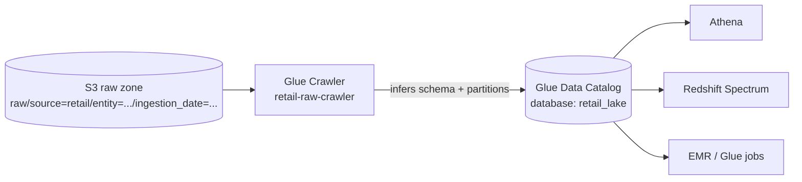

# Lab 02 — Catalog the Data Lake with a Glue Crawler

**Status: written and synth-verified; end-to-end AWS verification pending** (see [REPO-CONTENT-GAP-REPORT](../../REPO-CONTENT-GAP-REPORT.md)). You'll point an AWS Glue crawler at the raw zone from Lab 01, have it auto-discover the schema and partitions, and end up with a queryable table in the Glue Data Catalog. This is the metadata layer every query engine (Athena, Redshift Spectrum, EMR) reads.

**Prerequisite:** finish [Lab 01](../lab-01-s3-data-lake/) first — this lab crawls the data Lab 01 uploaded.

---

## 1. Objective

Understand what the Glue Data Catalog is, why a crawler exists, and how Hive-style partitions become queryable columns. By the end you can crawl an S3 prefix into a partitioned table and explain what the crawler inferred and why.

## 2. Business scenario

The retailer's raw zone now receives daily orders/customers/products files. Before anyone can run SQL over them, the platform needs a **catalog** — table definitions (schema + partitions + location) that query engines share. A crawler keeps that catalog in sync as new daily partitions land, so analysts never hand-write schemas.

## 3. Architecture



The crawler reads the S3 layout and writes table + partition metadata into the catalog; every downstream engine then reads that one catalog.

## 4. AWS services used

AWS Glue (Data Catalog + Crawler), IAM (crawler role), S3 (source), and AWS CDK to provision it. Athena is used lightly to confirm the table works (full Athena is Lab 04).

## 5. Prerequisites

- Lab 01 completed: the `DataLakeStack` is deployed and sample data uploaded to the raw bucket.
- AWS CLI v2 configured; CDK installed; `pip install -r infra/cdk/requirements.txt`.
- The raw bucket name from Lab 01's output.

## 6. 💰 Estimated cost & safety

A crawler run is billed per DPU-hour; for this tiny dataset a run is a few cents and finishes in a minute or two. The catalog database/tables are free. **Run the cleanup (Section 15).** Never leave crawlers on a schedule you forgot about.

## 7. Step-by-step setup

Get the raw bucket name from Lab 01:
```bash
RAW_BUCKET=$(aws cloudformation describe-stacks --stack-name DataLakeStack \
  --query "Stacks[0].Outputs[?OutputKey=='RawBucketName'].OutputValue" --output text)
echo "$RAW_BUCKET"
```

If you haven't uploaded data yet (or want a fresh partition):
```bash
python scripts/upload_sample_data.py --bucket "$RAW_BUCKET" --ingestion-date 2026-07-01
python scripts/validate_s3_layout.py --bucket "$RAW_BUCKET" --ingestion-date 2026-07-01
```

## 8. Code explanation

The crawler and catalog are defined in [`infra/cdk/stacks/glue_catalog_stack.py`](../../infra/cdk/stacks/glue_catalog_stack.py):
- **`CfnDatabase` `retail_lake`** — the logical container for tables.
- **Least-privilege crawler role** — the managed `AWSGlueServiceRole` plus `s3:GetObject`/`s3:ListBucket` scoped to *only* the raw bucket's `raw/*` prefix. The crawler can't touch anything else.
- **`CfnCrawler`** pointed at `s3://<raw>/raw/` with `UPDATE_IN_DATABASE` schema policy, so re-crawling updates the table/partitions in place rather than duplicating.

## 9. Deployment

```bash
cd infra/cdk
cdk deploy GlueCatalogStack -c raw_bucket_name="$RAW_BUCKET"
```

Outputs the database name (`retail_lake`) and crawler name (`retail-raw-crawler`).

## 10. Trigger (run the crawler)

```bash
aws glue start-crawler --name retail-raw-crawler

# wait for it to finish (poll state):
aws glue get-crawler --name retail-raw-crawler --query "Crawler.State" --output text
# repeat until it returns READY (it cycles RUNNING -> STOPPING -> READY)
```

## 11. Validation

List the tables the crawler created:
```bash
aws glue get-tables --database-name retail_lake \
  --query "TableList[].Name" --output text
```
You should see tables for the crawled data (e.g. a `raw` table with partition keys `source`, `entity`, `ingestion_date`). Inspect the partition keys:
```bash
aws glue get-table --database-name retail_lake --name raw \
  --query "Table.PartitionKeys[].Name" --output text
# expected: source  entity  ingestion_date
```

Quick Athena sanity check (optional; full Athena in Lab 04):
```bash
# Athena needs a results location — reuse the Athena results bucket from Lab 01.
# In the Athena console, run:  SELECT * FROM retail_lake.raw LIMIT 10;
```

## 12. Expected output

- `get-crawler` state returns `READY` after the run.
- `get-tables` lists at least one table in `retail_lake`.
- The table's `PartitionKeys` include `source`, `entity`, `ingestion_date` — proving the crawler auto-detected the Hive-style partitions from Lab 01's key design.

## 13. Troubleshooting

| Symptom | Cause | Fix |
|---|---|---|
| Crawler creates no tables | Wrong path or empty raw prefix | Confirm data exists: `aws s3 ls s3://$RAW_BUCKET/raw/ --recursive`. |
| Multiple tables instead of one | Mixed formats/schemas under one prefix | Keep one format per entity; the crawler groups by schema similarity. |
| Partitions not recognized | Keys not in `key=value` form | Lab 01's layout is correct; re-upload with the script if you hand-made keys. |
| `AccessDenied` during crawl | Role missing S3 read | The stack scopes it correctly; ensure you deployed with the right `raw_bucket_name`. |
| Athena "table not found" | Wrong database | Query `retail_lake.<table>`, and set an Athena results location. |

See also [Module 04 troubleshooting](../../04-batch-processing/) and the [runbook](../../TROUBLESHOOTING-RUNBOOK.md).

## 14. Interview questions

1. What is the Glue Data Catalog and who reads it? (Central metadata — schema/location/partitions — shared by Athena, Redshift Spectrum, EMR, Glue.)
2. What does a crawler actually do? (Scans S3, infers schema and partitions, writes/updates table definitions.)
3. Crawler vs defining tables manually — when each? (Crawler for evolving/unknown schemas and auto-partition discovery; manual DDL for stable, controlled schemas where you don't want surprises.)
4. Why did `source`/`entity`/`ingestion_date` become columns? (Hive-style `key=value` partition folders are auto-detected as partition columns.)
5. What's `UPDATE_IN_DATABASE` vs recreate? (Update partitions/schema in place on re-crawl instead of dropping and recreating.)

## 15. Cleanup (mandatory)

```bash
cd infra/cdk
cdk destroy GlueCatalogStack
```
Confirm the database is gone:
```bash
aws glue get-database --name retail_lake 2>&1 | grep -q "EntityNotFound" && echo "cleaned"
```
(Leave `DataLakeStack` if you're continuing to Lab 03/04; otherwise destroy it too and empty the buckets — see Lab 01 cleanup.)

## 16. Production notes

- **Scheduling:** in production a crawler runs on a schedule (EventBridge) or after each load, not manually. Balance freshness against per-run cost.
- **Partition projection:** for high-partition tables, Athena *partition projection* avoids crawler/`MSCK` overhead entirely by computing partitions from a pattern — often better than crawling at scale (Lab 04 / Module 02).
- **Schema evolution:** decide the policy deliberately — `LOG` deletes vs remove; breaking changes should alert, not silently reshape tables.
- **Catalog as contract:** treat table definitions as a governed, reviewed asset; downstream teams depend on them.

## 17. Architect-level extension

Crawlers are convenient but not free and not instant. At scale, many teams **stop crawling** and instead: (a) define tables as code (or via the ETL job that writes them), and (b) use **partition projection** so Athena computes partitions from the path pattern. Consider: for a table with 3 years of hourly partitions, is a nightly crawler cheaper and fresher than projection? Usually not. Design the catalog-update mechanism as a first-class decision, not a default. When the lake becomes an **Iceberg** lakehouse, the table format tracks its own metadata/partitions and the crawler's role shrinks further (Module 09).

---

### Related
- Module: [04 · Batch Processing](../../04-batch-processing/) (Glue depth) and [02 · Storage & S3 Lake](../../02-storage-s3-lake/).
- Stack: [`infra/cdk/stacks/glue_catalog_stack.py`](../../infra/cdk/stacks/glue_catalog_stack.py)
- Next: [Lab 03 — Glue ETL with PySpark](../lab-03-glue-etl-pyspark/) transforms this cataloged raw data into silver.
