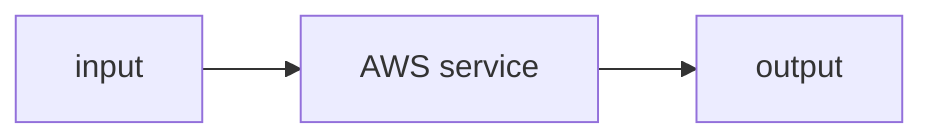

# lab-08-redshift-serverless

> **Status:** TODO scaffold — built to full depth alongside its module.

## Objective
_What you'll build and what you'll understand after._

## Architecture

## Prerequisites
- AWS CLI v2 configured (sandbox account you control)
- Budget alarm set
- Relevant module read first

## 💰 Cost warning
This lab creates **real, billable AWS resources**. Costs are small if you follow the cleanup step promptly, but **never leave resources running.**

## Steps
_TODO: exact CLI/CDK commands with REPLACE_ placeholders for account/region/bucket._

## Code
_TODO: links to `src/` and any lab-specific scripts._

## Validation
_TODO: how to confirm it worked._

## Cleanup
_TODO: exact teardown commands. **Mandatory.**_

## Interview questions
_TODO: 3–5 questions this lab prepares you to answer._

## Production notes
_TODO: what changes when this runs for real (idempotency, monitoring, scale)._
