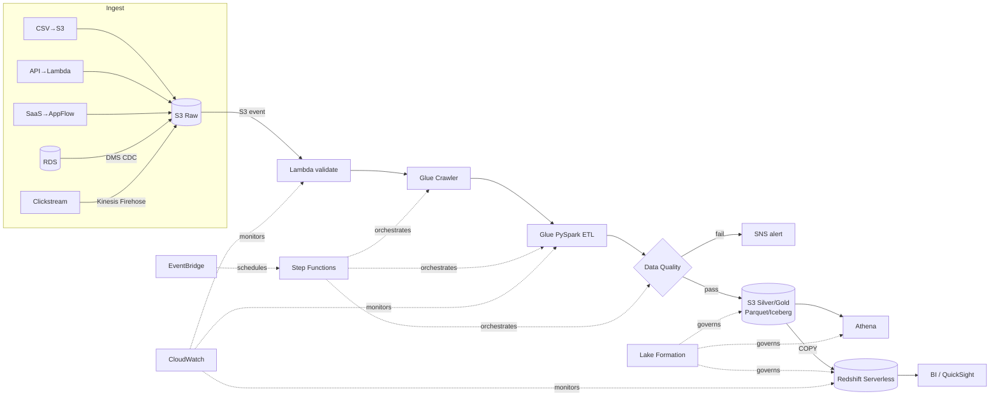

# Project 07 · Enterprise Retail Sales Data Platform

The capstone. A production-style AWS data platform for a retail company ingesting five source types into a governed lakehouse and warehouse. Everything in the repo builds toward this.

## Scenario
A retailer receives **sales, customer, product, inventory, and clickstream** data from multiple sources and needs a reliable, governed, cost-aware platform for analytics and BI.

## Sources
1. CSV files uploaded to S3
2. API data pulled by Lambda (scheduled)
3. CDC from RDS via DMS
4. Streaming clickstream via Kinesis
5. (Optional) third-party SaaS via AppFlow

## Pipeline

## What gets built (CDK stacks)
S3 buckets · IAM roles · Lambda · Glue (DB/crawler/job) · Step Functions · EventBridge schedule · CloudWatch alarms · SNS topic · Athena output location · optional Redshift Serverless. See [`../../infra/cdk/`](../../infra/cdk/).

## Code deliverables
- CDK stacks (above)
- Lambda handler ([`src/lambda/handler.py`](../../src/lambda/handler.py) — already seeded and unit-tested)
- Glue PySpark ETL job (`src/glue_jobs/`)
- Data quality validation (`src/quality/`)
- Athena SQL (`src/sql/`)
- Redshift DDL + COPY (`src/sql/`)
- Unit + integration + data-quality tests (`tests/`)

## 💰 Cost warning
This is the **most expensive** thing in the repo to run — it provisions DMS, Kinesis, Glue, and optionally Redshift. Deploy stack-by-stack, in a sandbox account, with a budget alarm, and **run `cdk destroy --all` when finished.** Do not deploy the full platform casually.

## Status
**SKELETON.** Architecture, CDK scaffold, and the validation Lambda are in place. Remaining stacks and jobs are built module-by-module — this README is the spec they fulfill. Marked example-only until each stack's `cdk deploy` is documented with exact commands.
